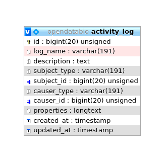

<a name="bibreference"></a>
## BibReference Model

The **BibReference** table contains basically [BibTex](http://www.bibtex.org/) formatted references stored in the `bibtex` column. You may easily import references into OpenDataBio by just specifying the `doi`, or simply uploading a bibtex record.  These bibliographic references may be used to:
  * Store references for [Datasets](/docs/concepts/data-access/#dataset) - with the option of defining references for which citation is mandatory when using the dataset in publications; but all references that have used the dataset may be linked to the dataset; links are done with a Pivot table named `dataset_bibreference`;
  * Store the references for [Taxons](/docs/concepts/core-objects/#taxon):
    - to specify the reference in which the Taxon name was described, currently mandatory in some Taxonomic journals like [PhytoTaxa](https://www.mapress.com/j/pt/). This description reference is stored in the `bibreference_id` of the Taxons table.
    - to register any reference to a Taxon name, which are then linked through a pivot table named `taxons_bibreference`.
  * Link a [Measurement](/docs/concepts/trait-objects/#measurement) to a published source;
  * Indicate the source of a [Trait](/docs/concepts/trait-objects/#trait) definition.
  * Indicate mandatory citations for a Dataset, or link references using the data to a Dataset


*BibReference model and its relationships. Lines linking tables indicate the `methods` implemented, with colors indicating different Eloquent relationships.*

### Bibreferences table
- The BibtexKey, authors and other relevant fields are extracted from the `bibtex` column.
- The **Bibtexkey  must be unique** in the database, and a helper function is be provided to standardize it with format `<von? last name> <year> <first word of title>`. The "von part" of the name is the "von", "di", "de la",  which are part of the last name for some authors. The first word of the title ignores common stop-words such as "a", "the", or "in".
- [DOIs](https://www.doi.org/) for a BibReference may be specified either in the relevant BibTex field or in a separate text input, and are stored in the `doi` field when present. An external API finds the bibliographic record when a user informs the `doi`.

<br>
 **Data access** [full users](/docs/concepts/data-access/#user) may register new references, edit references details and remove reference records that have no associated data. BibReferences have public access!

***
<a name="biocollection"></a>
## Biocollections

The **Biocollection** object currently only stores basic information about Biological Collections that may be used for [Vouchers](/docs/concepts/core-objects/#voucher), to indicate in which Biological Collections the voucher is deposited. The Biocollection object may be a formal Biocollection, such as those registered in the Index Herbariorum (http://sweetgum.nybg.org/science/ih/), or any other Biological Collection, formal or informal.  

The Biocollection object also interacts with the [Person](/docs/concepts/auxiliary-objects/#person) model. When a Person is linked to an Biocollection it will be listed as a taxonomic specialist.

Currently ODB does not uses the BioCollection model to actually manage Voucher records. However, depending on demand this may be easily implemented, associating elements to allow curators to manage their collections, such as tracking specimens loans, donations, quality, etc.

 

**Data Access** - only administrators can register new Biocollections and delete unused biocollection. Updates are not yet implemented.

***
<a name="identification"></a>

## Identification Model

The **Identification** table represents the taxonomic identification of [Individuals](/docs/concepts/core-objects/#individual).


*Identification model and its relationships. Lines linking tables indicate the `methods` implemented, with colors indicating different Laravel Eloquent relationships*

### Identifications table

* The Identification model includes several optional fields, but in addition to `taxon_id`, `person_id`, the [Person](/docs/concepts/auxiliary-objects/#person) responsible for the identification, and the identification `date` are mandatory.
- The `date` value may be an [Incomplete Date](/docs/auxiliary-objects/#incomplete-date), e.g. only the year or year+month may be recorded.
* The following fields are optional:
  * `modifier` - is a numeric code appending a taxonomic modifier to the name. Possible values 's.s.'=1, 's.l.'=2, 'cf.'=3, 'aff.'=4, 'vel aff.'=5, defaults to 0 (none).
  * `notes` - a text of choice, useful for adding comments to the identification.
  * `biocollection_id` and `biocollection_reference` - these fields are to be used to indicate that the identification is based upon comparison to a voucher deposited in a Biological Collection and creates a link between the Individual identified and the BioCollection specimen from which the identification is based upon. `biocollection_id` stores the [Biocollection](/docs/concepts/auxiliary-objects/#biocollection) id, and `biocollection_reference` the unique identifier of the specimen compared, i.e. would be the equivalent of the `biocollection_number` of the Voucher model, but this reference does not need to be from a voucher registered in the database.
* The relationship with the Individual model is defined by a [polymorphic relationship](/docs/contribution-guidelines/#polymorphicrelationships) using fields `object_type` and `object_id` [This could be replaced by an 'individual_id' in the identification table. The polymorphic relation inherited from a previous development version, kept because the Identification model may be used in the future to link Identifications to Measurements].
* Changes in identifications are [audited](#audits) for tracking change history

 **Data access**: identifications are attributes of Individuals and do not have independent access!


***
<a name="person"></a>

## Person Model

The **Person** object stores persons names, which may or may not be a [User](/docs/concepts/data-access/#user) directly involved with the database. It is used to store information about people that are:
    * **collectors** of [Vouchers](/docs/concepts/core-objects/#vouchers), [Individuals](/docs/concepts/core-objects/#individual) and [MediaFiles](/docs/concepts/auxiliary-objects/#media)
    * **taxonomic determinators** or identifiers of [individuals](/docs/concepts/core-objects/#individual);
    * **measurer** of [Measurements](/docs/concepts/trait-objects/#measurement);
    * **authors** for *unpublished* [Taxon](/docs/concepts/core-objects/#taxon) names;
    * **taxonomic specialists** - linked with Taxon model by a pivot table named `person_taxon`;
    * **dataset authors** - defining authors for the dynamic publication of datasets;


*Person model and its relationships. Lines linking tables indicate the `methods` implemented, with colors indicating different types of Laravel Eloquent methods, solid lines the direct and dashed the indirect relationships*

### Persons table

- mandatory columns are the person `full_name` and `abbreviation`;
- when registering a new person, the system suggests the name `abbreviation`, but the user is free to change it to better adapt it to the usual abbreviation used by each person. The **abbreviation must be unique** in the database, duplicates are not allowed in the Persons table. Therefore, two persons with the exact same name must be differentiated somehow in the `abbreviation` column.
- The `biocollection_id` column of the Persons table is used to list to which [Biocollection](/docs/concepts/auxiliary-objects/#biocollection) a person is associated, which may be used when the Person is also a taxonomic specialist.
- Additionally, the `email` and `institution` the person belongs to may also be informed.
- Each user can be linked to a Person by the `person_id` in the User table. This person is then used the 'default' person when the user is logged into the system.

<br>
**Data access** [full users](/docs/concepts/data-access/#user) may register new persons and edit the persons they have inserted and remove persons that have no associated data. Admins may edit any Person. Persons list have public access.

***
<a name="media"></a>
## Media Model

**Media files** are similar to [measurements](/docs/concepts/trait-objects/#measurement) in that they might be associated with any [core object](/docs/concepts/core-objects). Media files may be images (jpeg, png, gif, tif), video or audio files and can be made freely accessible or placed in a [Dataset](/docs/concepts/data-access/#dataset) with a defined access policy. A <a href="https://creativecommons.org/licenses/">CreativeCommons.org</a> license must be assigned to them. Media files may be **tagged**, i.e. you may define keywords to them, allowing to query them by [Tags](/docs/concepts/auxiliary-objects/#tag). For example, an individual image may be tagged with 'flowers' or 'fruits' to indicate what is in the image, or a tag that informs about image quality.


* Media files (image, video, audio) are linked to the [Core-Objects](/docs/concepts/core-objects) through a [polymorphic relationship](/docs/contribution-guidelines/#polymorphicrelationships) defined by columns `model_id` and `model_type`.
* Multiple [Persons](#persons) may be associated with the Media for credits, these are linked with the **Collectors** table and its [polymorphic relationship](/docs/contribution-guidelines/#polymorphicrelationships) structure.
* A Media may have a `description` in each language configured in the Language table, which will be stored in the `user_translations` table, which relates to the Tag model through a [polymorphic relationship](/docs/contribution-guidelines/#polymorphicrelationships). Inputs for each language are shown in the web-interface forms.
* Media files are not stored in the database, but in the server storage folder.
* It is possible to **batch upload media files** through the web interface, requiring also a file informing the objects to link the media with.


**Data access** [full users](/docs/concepts/data-access/#user) may register media files and delete the ones they have inserted. If Media is in a Dataset, dataset admins may delete the media in addition to the user. Media files have public access, except when linked to a Dataset with access restrictions.

***
<a name="tag"></a>

## Tag Model

The **Tag** model allows users to define **translatable keywords** that may be used to flag [Datasets](/docs/concepts/data-access/#dataset), [Projects](/docs/concepts/data-access/#project) or [MediaFiles](/docs/concepts/auxiliary-objects/#media). The Tag model is linked with these objects through a pivot table for each, named `dataset_tag`, `project_tag` and `media_tag`, respectively.

A Tag may have `name` and `description` in each language configured in the Language table, which will be stored in the `user_translations` table, which relates to the Tag model through a [polymorphic relationship](/docs/contribution-guidelines/#polymorphicrelationships). Inputs for each language are shown in the web-interface forms.


**Data access** [full users](/docs/concepts/data-access/#user) may register tags, edit those they have inserted and delete those that have not been used. Tags have public access as they are just keywords to facilitate navigation.

***
<a name="user-translation"></a>
## User Translation Model

The **UserTranslation** model translates user data: [Trait](/docs/concepts/trait-objects/#trait) and Trait Categories names and descriptions, [MediaFiles](/docs/concepts/auxiliary-objects/#media) descriptions and [Tags](/docs/concepts/auxiliary-objects/#tag). The relations between these models are established by [polymorphic relations](/docs/concepts/core-objects/#polymorphicrelationships) using fields `translatable_type` and `translatable_id`. This model permits translations to any language listed in the **Language** table, which is currently only accessible for insertion and edition directly in the SQL database. Input forms in the web interface will be listed for registered Languages.


***
<a name="incomplete-date"></a>
## Incomplete Dates

Dates for [Vouchers](/docs/concepts/core-objects/#voucher), [Individuals](/docs/concepts/core-objects/#individual), [Measurements](/docs/concepts/trait-objects/#measurement) and [Identifications](/docs/concepts/auxiliary-objects/#identification) may be Incomplete, but at least **year** is mandatory in all cases. The `date` columns in the tables are of 'date' type, and incomplete dates are stored having 00 in the missing part: '2005-00-00' when only year is known; '1988-08-00' when only month is known.

***
<a name="auditing"></a>
## Auditing

Modifications in database records are logged to the **activity_log** table. This table is generated by the package [ActivityLog](https://github.com/spatie/laravel-activitylog). The activities are shown in a 'History' link provided in the Show.view of the models.
1. The package stores changes as json in the `properties` field, which contains two elements: `attributes`  and `old`, which are basically the new vs old values that have been changed. This structure must be respected.
1. Class **ActivityFunctions** contain custom functions to read the the properties Json record stored in the `activity_log` table and finds the values to show in the History datatable;
1. Most changes are logged by the package as a 'trait' called within the Class. These allow to automatically log most updates and are all configured to log only the fields that have changed, not entire records (option `dirty`). Also record creation are not logged as activity, only changes.
1. Some changes, like Individual and Vouchers collectors and identifications are manually logged, as they involve related tables and logging is specified in the Controller files;
1. Logging contain a `log_name` field that groups log types, and is used to distinguish types of activity and useful to search the History Datatable;
1. Two special logging are also done:
  1. Any Dataset download is logged, so administrators may track who and when the dataset was downloaded;
  1. Any Dataset request is also logged for the same reason

**The `clean-command` of the package SHOULD NOT be used during production, otherwise will just erase all logged changes**. If run, will erase the logs older than the time specified in the `/config/activitylog.php` file.

<br>
The ActivityLog table has the following structure:



*  `causer_type` and `causer_id`  will be the [User](/docs/concepts/data-access/#user) that made the change
*  `subject_type` and `subject_id` will the model and record changed
*  `log_name` - to group logs together and permits queries
*  `description` - somewhat redundant with log_name in a OpenDataBio context.
*  `properties` - stores the changes, for example, and identification change will have a log like:


```JSON
{
    "attributes":
    {
        "person_id":"2",
        "taxon_id":"1424",
        "modifier":"2",
        "biocollection_id":"1",
        "biocollection_reference":"1234",
        "notes":"A new fake note has been inserted",
        "date":"2020-02-08"},
    "old":{
        "person_id":674,
        "taxon_id":1413,
        "date":"1995-00-00",
        "modifier":0,
        "biocollection_id":null,
        "notes":null,
        "biocollection_reference":null
    }
}

```
