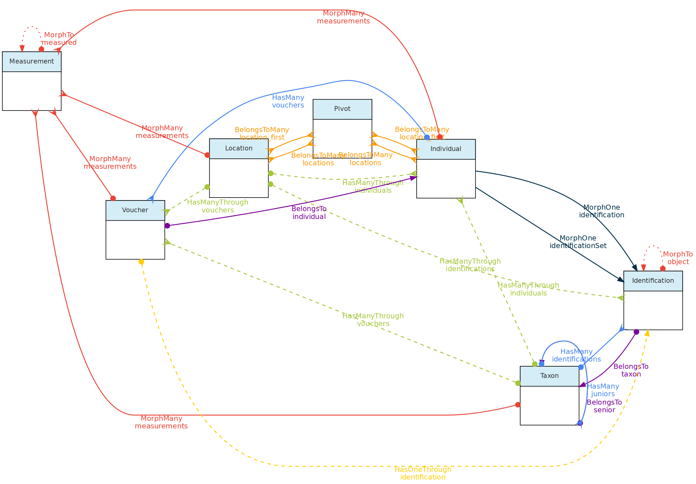
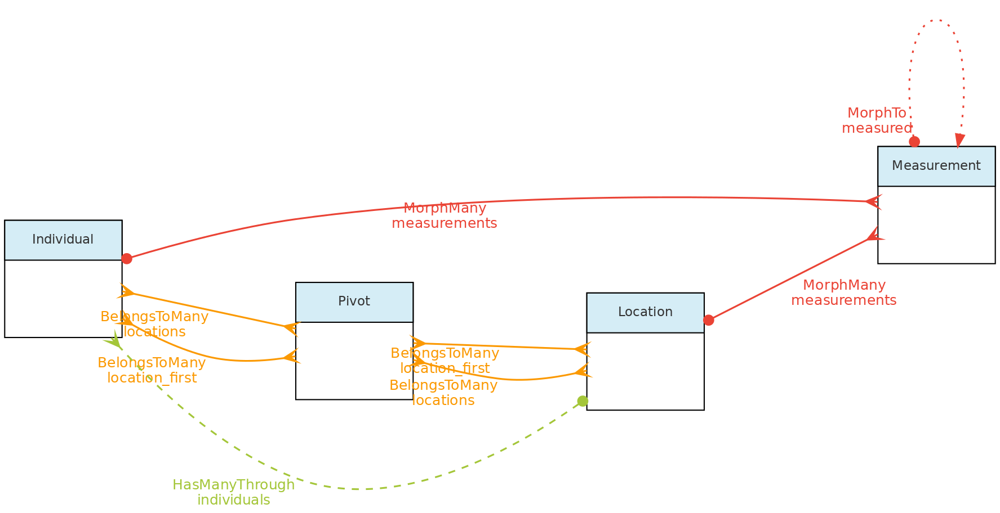
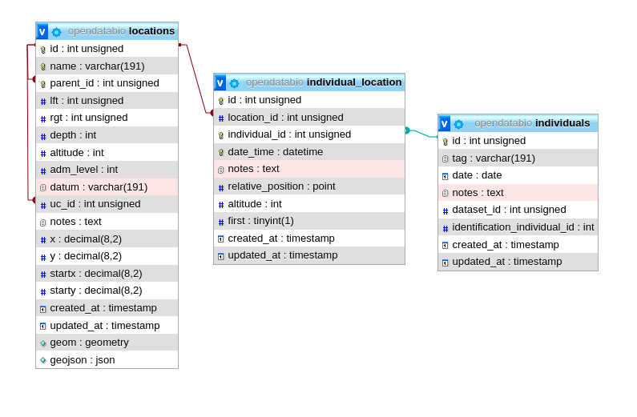
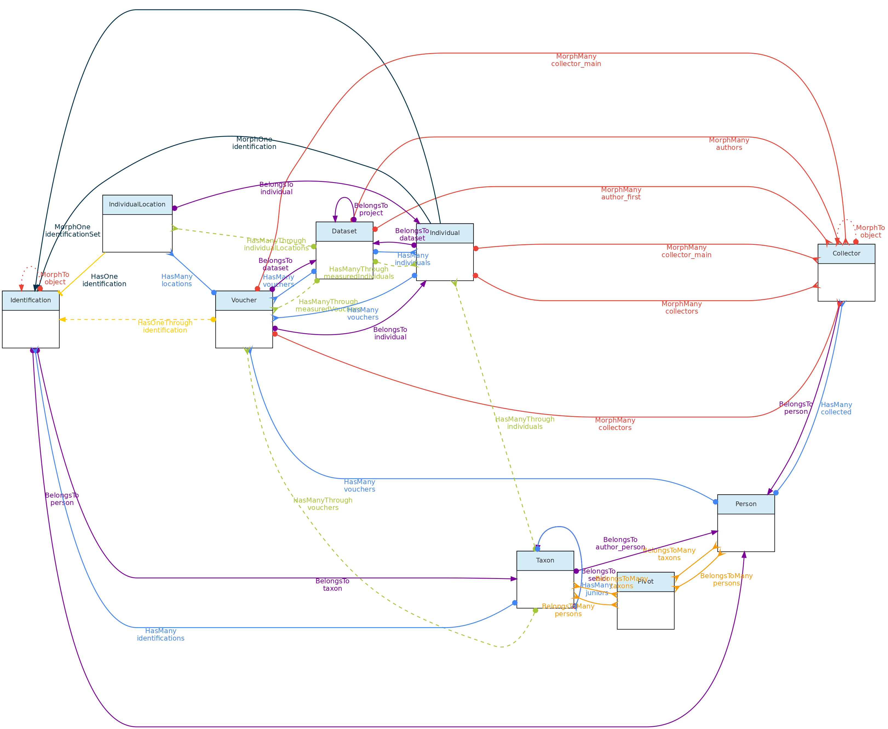
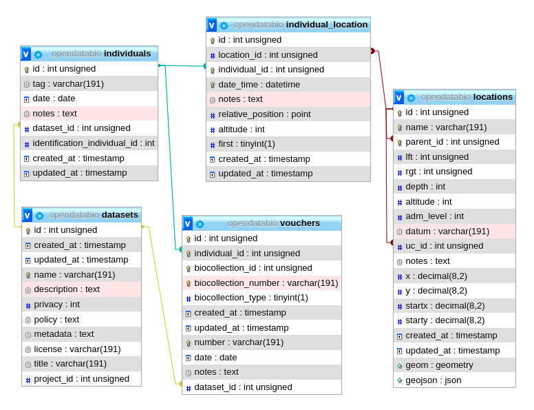
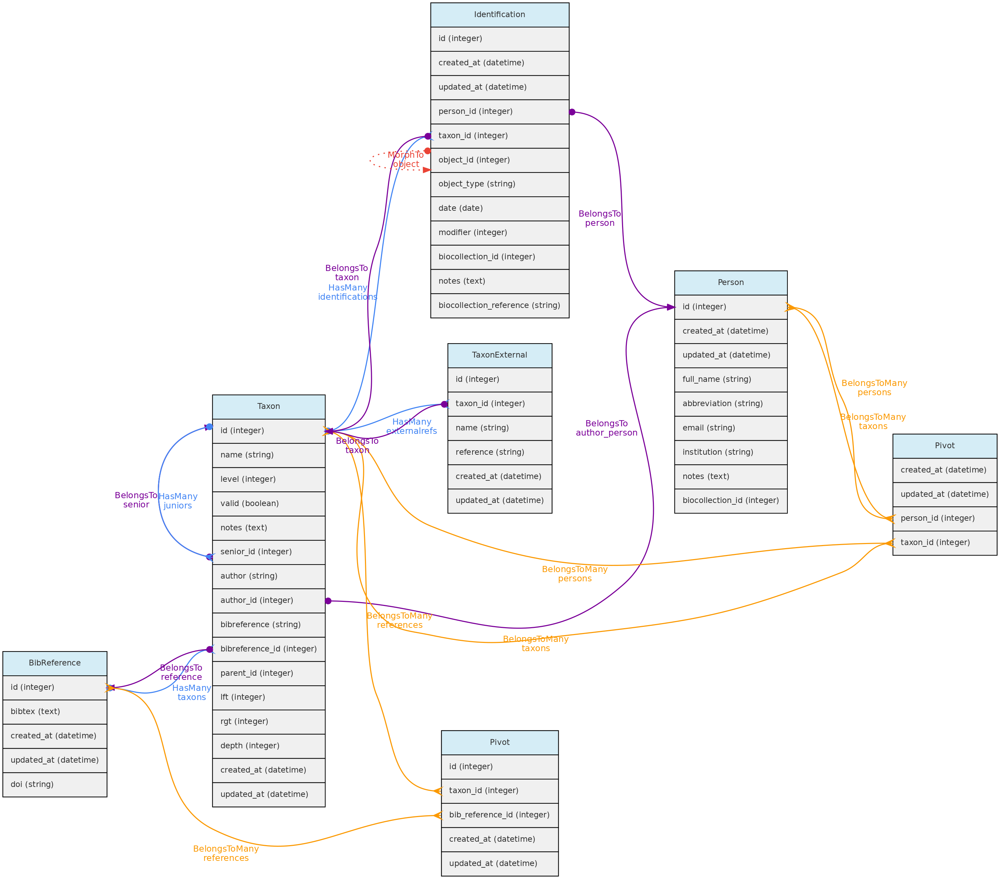
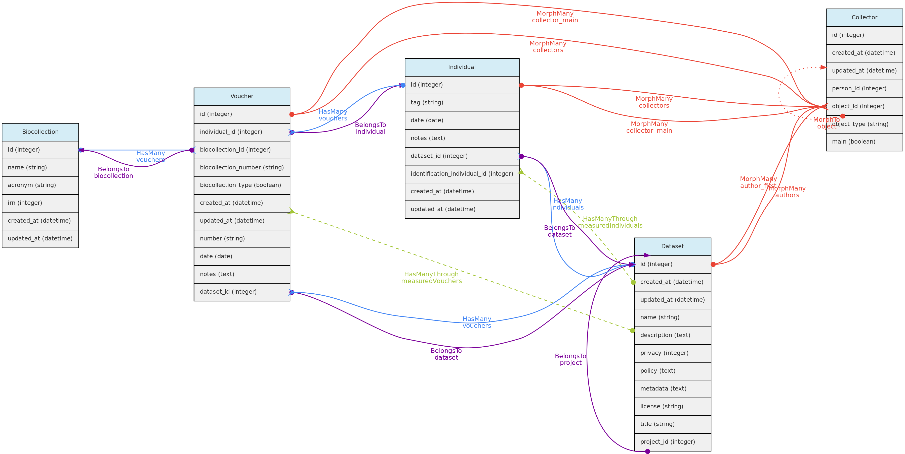

Core objects are: [Location](/docs/concepts/core-objects/#location), [Voucher](#voucher), [Individual](/docs/concepts/core-objects/#individual) and [Taxon](/docs/concepts/core-objects/#taxon). These entities are considered "Core" because they may have [Measurements](/docs/concepts/trait-objects/#measurement), i.e. you may register values for any custom [Trait](/docs/concepts/trait-objects/#trait).

* The [Individual](/docs/concepts/core-objects/#individual) object refer to Individual organism that have been observed once (an occurrence) or has been tagged for monitoring, such as tree in a permanent plot, a banded bird, a radio-tracked bat. Individuals may have one or more [Vouchers](/docs/concepts/core-objects/#voucher)in a [BioCollection](/docs/concepts/auxiliary-objects), and one or multiple [Locations](/docs/concepts/core-objects/#location), and will have a taxonomic  [Identification](/docs/concepts/auxiliary-objects/#identification). Any attribute measured or taken for individual organism may be associated with this object through the [Measurement Model](/docs/concepts/trait-objects/#measurement) model.

* The [Voucher](/docs/concepts/core-objects/#voucher)object is for records of specimens from [Individuals](/docs/concepts/core-objects/#individual) deposited in a [Biological Collection](/docs/concepts/auxiliary-objects/#biocollection). The taxonomic Identification and the Location of a Voucher is that of the Individual it belongs to. [Measurements](/docs/concepts/trait-objects/#measurement) may be linked to a Voucher when you want to explicitly register the data to that particular sample (e.g. morphological measurements; a molecular marker from an extraction of a sample in a tissue collection). Otherwise you could just record the Measurement for the Individual the Voucher belongs to. The voucher model is also available as special type of [Trait](/docs/concepts/trait-objects/#trait), the `LinkType`, making it possible to record counts for the voucher's Taxon at a particular Location.

* The [Location](/docs/concepts/core-objects/#location) object contains spatial geometries, like points and polygons, and include `plots` and `transects` as special cases. An [Individual](/docs/concepts/core-objects/#individual) may have one location (e.g. a plant) or more locations (e.g. a monitored animal). Plots and Transect locations may be registered as a spatial geometry or only point geometry, and may have Cartesian dimensions (meters) registered. Individuals may also have Cartesian positions (X and Y or Angle and Distance)  relative to their Location, allowing to account for traditional mapping of individuals in sampling units. Ecological relevant measurements, such as soil or climate data are examples of measurements that may be linked to locations [Measurement](/docs/concepts/trait-objects/#measurement).

* The [Taxon](/docs/concepts/core-objects/#taxon) object in addition to its use for the [Identification](/docs/concepts/auxiliary-objects/#identification) of Individuals, may receive Measurements, allowing the organization of secondary, published data, or any kind of information linked to a Taxonomic name. A [BibReference](/docs/concepts/auxiliary-objects/#bibreference) may be included to indicate the data source. Moreover, the Taxon model is available as special type of [Trait](/docs/concepts/trait-objects/#trait), the `LinkType`, making it possible to record counts for Taxons at a particular Location.
 
 

*This figure show the relationships among the `Core objects` and with the [Measurement Model](/docs/concepts/trait-objects/#measurement). The [Identification Model](/docs/concepts/auxiliary-objects/#identification) is also included for clarity. Solid links are direct relationships, while dashed links are indirect relationships (e.g. Taxons has many Vouchers through Individuals, and have many Individuals through identifications). The red solid lines link the `Core objects` with the Measurement model through [polymorphic relationships](/docs/contribution-guidelines/#polymorphicrelationships). The dotted lines on the Measurement model just allow access to the measured core-object and to the models of link type traits.*
 
 

***
## Location Model

The **Locations** table stores data representing real world locations. They may be countries, cities, conservation units, or any spatial polygon, point or linestring on the surface of Earth. These objects are hierarchical and have a parent-child relationship implemented using the Nested Set Model for hierarchical data of the Laravel library [Baum](https://github.com/etrepat/baum) and facilite both validation and queries.

Special location types are `plots` and `transects`, which together with `point` locations allow different sampling methods used in biodiversity studies. These Location types may also be linked a parent location and in addition also to three additional types of location that may span different administrative boundaries, such as `Conservation Units`, `Indigenous Territories` and any `Environmental` layer representing vegetation classes, soil classes, etc...with defined spatial geometries.

*This figure shows the relationships of the `Location` model throught the methods implemented in the shown classes. The pivot table linking Location to Individual allow an individual to have multiple locations and each location for the individual to have specific attributes like date_time, altitude, relative_position and notes.*
  

*The same tables related with the Location model with the direct and non-polymoprhic relationships indicated*.

### Location Table Columns

- Columns `parent_id` together with `rgt`, `lft` and `deph` are used to define the Nested Set Model to query ancestors and descendants in a fast way. Only `parent_id` is specified by the user, the other columns are calculated by the Baum library trait from the id\+parent_id values that define the hierarchy. The same hierarchical model is used for the [Taxon Model](/docs/concepts/core-objects/#taxon), but for Locations there is a **spatial constraint**, i.e. a children must fall within a parent geometry.
- The `adm_level` column indicate the administrative level, or type, of a location. By default, the following `adm_level` are configured in OpenDataBio:
  - `2` for country, `3` for first division within country (province, state), `4` for second division (e.g. municipality),...  up to `adm_level=10` as administrative areas (country code is 2 to allow standardization with [OpenStreeMaps](https://wiki.openstreetmap.org/wiki/Tag:boundary%3Dadministrative#admin_level.3D.2A_Country_specific_values), which is recommended to follow if your installation will include data from different countries). The administrative levels may be configured in an OpenDataBio **before** importing any data to the database, see the [installation guide](/docs/getting-started) for details on that.
  - `99` is the code for *Conservation Units*  - a conservation unit is a `location` that may be linked to multiple other locations (any location may belong to a single UC). Thus, one Location may have as parent a city and as uc_id the conservation unit where it belongs.
  - `98` is the code for *Indigenous Territories* - same properties as Conservation Units, but treated separately only because some CUs and TIs may largely overlap as is the case the Amazon region
  - `97` ise the code for *Environmental layers* - same properties as Conservation Units and Indigenous Territories, i.e., may be linked as additional location to any Point, Plot or Transect, and thehence, their related individuals. Store polygons and multipolygon geometries representing environmental classes, such as vegetation units, biomes, soil classes, etc...
  - `100` is the code for `plots` and subplots - plot locations may be registered with Point or with a Polygon geometry, and must also have an associated Cartesian dimensions in meters. If it is a point location, the geometry is defined by ODB from the dimensions with NorthEast orientation from the point informed. Cartesian dimensions of a plot location can also be combined with cartesian positions of subplots (i.e. a plot location whose parent is also a plot location) and/or of individuals within such plots, allowing individuals and subplots to be mapped within a `plot` subplot location without geometry specifications. In other words, if the spatial geometry of the plot is unknown, it may have as geometry a single GPS point rather than a polygon, plus its `x` and `y` dimensions. A subplot is location plot inside a location plot and must consist of a point marking the start of the subplot plus its X and Y cartesian dimensions. If the geometry of the start of the subplot is unknown, it may be stored as a relative position to parent plot using the `startx` and `starty`.
  - `101` for transects - like plots, transects may be registered having a LineString geometry or simply a single Latitude and Longitude coordinates and a dimension. The `x` cartesian dimension for transects represent the length in meters and is used to create a linestring (North oriented) when only a point is informed. The `y` dimension is used to validate individuals as belonging to transect location, and represents the maximum distance from the line that and individual must fall to be detected in that location.
  - `999` for 'POINT' locations like GPS waypoints - this is for registration of any point in space
- Column `datum` may record the geometry datum property, if known. If left blank, the location is considered to be stored using [WGS84](https://en.wikipedia.org/wiki/World_Geodetic_System) datum. However, there is no built-in conversor from other types of data, so the maps displayed may be incorrect if different datum's are used. **Strongly** recommended to project data as WSG84 for standardization.
- Column `geom` stores the location geometry in the database, allowing spatial queries in SQL language, such as `parent autodetection`. The geometry of a location may be `POINT`, `POLYGON`, `MULTIPOLYGON`  or `LINESTRING` and must be formatted using [Well-Known-Text](https://en.wikipedia.org/wiki/Well-known_text) geometry representation of the location. When  a POLYGON is informed, the **first point within the geometry string is privileged**, i.e. it may be used as a reference for relative markings. For example, such point will be the reference for the `startx` and `starty` columns of a subplot location. So for `plot` and `transect` geometries, it matters which point is listed first in the WKT geometry

**Data access** [Full users](/docs/concepts/data-access/#user) may register new locations, edit locations details and remove locations records that have no associated data. Locations have open access!

***

## Individual Model

The **Individual** object represents a record for an individual organism. It may be a single time-space occurrence of an animal, plant or fungi, or an individual monitored through time, such as a plant in a permanent forest plot, or an animal in capture-recapture or radio-tracking experiment.

An **Individual** may have one or more [Vouchers](/docs/concepts/core-objects/#voucher)representing physical samples of the individual stored in one or more [Biological Collection](/docs/concepts/auxiliary-objects/#biocollection) and it may have one or more [Locations](/docs/concepts/core-objects/#location), representing the place or places where the individual has been recorded.  

Individual objects may also have a **self** taxonomic [Identification](/docs/concepts/auxiliary-objects/#identification) or its taxonomic identity may depend on that of another individual (**non-self** identification). The Individual identification is inherited by all the Vouchers registered for the Individual. Hence Vouchers do not have their separate identification.

*This figure shows the Individual Model and the models it relates to, except the Measurement and Location models, as their relationships with Individuals is shown elsewhere in this page. Lines linking models indicate the `methods` or functions implemented in the classes to access the relationships. Dashed lines indicate indirect relationships and the colors the different types of Laravel Eloquent methods.*

*The Individual model direct and non-polymoprhic relationships*.

### Individual Table Columns

- A Individual record **must** specify at least one [Location](/docs/concepts/core-objects/#location) where it was registered, the `date` of registration, the local identifier `tag`, and the `collectors` of the record, and the `dataset_id` the individual belongs to.
- The Location may be any location registered, regardless of level, allowing to store historical records whose georeferencing is just an administrative location. Individual locations are stored in the `individual_location` pivot table, having columns `date_time`, `altitude`, `notes` and `relative_position` for the individual location records.
- The column `relative_position` stores the Cartesian coordinates of the Individual in relation to its Location. This is only for  individuals located in locations of type `plot`, `transect` or `point`. For example, a Plot location with dimensions 100x100 meters (1ha) may have an Individual with `relative position=POINT(50 50)`, which will place the individual in the center of the location (this is shown graphically in the web-interface), as is defined by the `x` and `y` coordinates of the individual. If the location is a subplot, then the position within the parent plot may also be calculated (this was designed with ForestGeo plots in mind and is a column in the [Individual GET API](/docs/api/get-data/individuals-endpoint). If the location is a POINT, the relative_position may be informed as `angle` (= azimuth) and `distance`, attributes frequently measured in sampling methods. If the location is a TRANSECT, the relative_position places the individual in relation to the linestring, the `x` being the distance along the transect from the first point, and the `y` the perpendicular distance where the individual is located, also accounting for some sampling methods;
- The `date` field in the Individual, Voucher, Measurement and Identification models may be an [Incomplete Date](/docs/concepts/auxiliary-objects/#incomplete-date), i.e., only the year or year+month may be recorded.
- The **Collector** table represents collectors for an Individual or Voucher, and is linked with the [Person Model](/docs/concepts/auxiliary-objects/#person). The collector table has a polymorphic relationship with the Voucher and Individual objects, defined by columns `object_id` and `object_type`, allowing multiple collectors for each individual or voucher record. The main_collector indicated is just the first collector listed for these entities.
- The `tag` field is a user code or identifier for the Individual. It may be the number written on the aluminum tag of a tree in a forest plot, the number of a bird-band, or the `collector number` of a specimen. The combination of `main_collector`+`tag`+`first_location` is constrained to be unique in OpenDataBio.
- The **taxonomic identification** of an Individual may be defined in two ways:
  - for *self* identifications an [Identification](/docs/concepts/auxiliary-objects/#identification) record is created in the *identifications* table, and the column `identification_individual_id` is filled with the Individual own `id`
  - for *non-self* identifications, the id of the Individual having the actual Identification is stored in column `identification_individual_id`.
  - Hence, the Individual class contain two methods to relate to the Identification model: one that sets *self identifications* and another that retrieves the actual taxonomic identifications by using column `identification_individual_id`.
- Individuals may have one or more [Vouchers](/docs/concepts/core-objects/#voucher)deposited in a [Biocollection](/docs/concepts/auxiliary-objects/#biocollection).
  
**Data access** Individuals belong to [Datasets](/docs/concepts/data-access/#dataset), so Dataset access policy apply to the individuals in it. Only project collaborators and administrators may insert or edit individuals in a dataset, even if dataset is of public access.

***

## Taxon Model

The general idea behind the **Taxon** model is to present tools for easily incorporating valid taxonomic names from Online Taxonomic Repositories (currently Tropicos.org and GBIF are implemented), but allowing for the inclusion of names that are not considered valid, either because they are still **unpublished** (e.g. a morphotype), or the user disagrees with published synonymia, or the user wants to have all synonyms registered as invalid taxons in the system.  Moreover, it allows one to define a custom `clade` level for taxons, allowing one to store, in addition to taxonomic rank categories, any node of the tree of life.  Any registered Taxon can be used in Individual identifications and Measurements may be linked to taxonomic names.

*Taxon model and its relationships. Lines linking tables indicate the `methods` implemented in the shown classes, with colors indicating different Eloquent relationships*

### Taxon table explained

- Like, Locations, the Taxon model has a **parent-child relationship**, implemented using the Nested Set Model for hierarchical data of the [Laravel library Baum](https://github.com/etrepat/baum) that allows to query ancestors and descendants. Hence, columns `rgt`, `lft` and `deph` of the taxon table are automatically filled by this library upon data insertion or update.
- For both, Taxon `author` and Taxon `bibreference` there are two options:
  - For published names, the string authorship retrieved by the external taxon APIs will be placed in the `author=string` column. For unpublished names, author is a [Person](/docs/concepts/auxiliary-objects/#person) and will be stored in the `author_id` column.
  - Only published names may have relation to BibReferences. The `bibreference` string field of the Taxon table stores the strings retrieved through the external APIs, while the `bibreference_id` links to a [BibReference](/docs/concepts/auxiliary-objects/#bibreference) object. These are used to store the Publication where the Taxon Name is described and may be entered in both formats.
  - In addition, a Taxon record may also have many other BibReferences through a pivot table (`taxons_bibreference`), permitting to link any number of bibliographic references to a Taxon name.
* Column `level` represents the taxonomic rank (such as order, genera, etc). It is numerically coded and standardized following the [IAPT general rules](http://www.iapt-taxon.org/nomen/main.php?page=art3), but should accommodate also animal related taxon level categories. See the available codes in the [Taxon API](/docs/api/get-data/#taxons-endpoint) for the list of codes.
* Column `parent_id` indicates the parent of the taxon, which may be several levels above it. The parent level should be strictly higher than the taxon level, but you do not need to follow the full hierarchy. It is possible to register a taxon without parents, for example, an unpublished morphotype for which both genera and family are unknown may have an `order` as parent.
* Names for the taxonomic ranks are translated according to the system defined `locale` that also translates the web interface (currently only Portuguese and English implemented).
* The `name` field of the taxon table contain only the specific part of name (in case of species, the specific epithet), but the insertion and display of taxons through the [API](/docs/api) or webinterface should be done with the fullname combination.
* It is possible to include **synonyms** in the Taxon table. To do so, one must fill in the `senior` relationship, which is the id of the  accepted (`valid`) name for an `invalid` Taxon. If `senior_id` is filled, then the taxon is a `junior` synonym and must be flagged as **invalid**.
* When inserting a new published taxon, only the `name` is required. The name will be validated and the author, reference and synonyms will be retrieved using the following API services:
  1. [GBIF BackBone Taxonomy](https://www.gbif.org/dataset/search) - this will be the first check, from which links to Tropicos and IPNI may also be retrieved if registering a plant name.
  1. [Tropicos](http://tropicos.org) - if not found on GBIF, ODB will search the name on the Missouri Botanical Garden nomenclature database.  
  1. [IPNI](http://www.ipni.org) - the International Individual Names Index is another database used to validate individual names (**Temporarily disabled**)
  1. [MycoBank](http://www.mycobank.org) - used to validate a name if not found by the Tropicos nor IPNI apis, and used to validate names for Fungi. **Temporarily disabled**
  1. [ZOOBANK](http://zoobank.org) - when GBIF, Tropicos, IPNI and MycoBank fails to find a name, then the name is tested against the ZOOBANK api, which validates animal names. Does not provide taxon publication, however.  
* If a Taxon name is found in the Nomenclatural databases, the respective ID of the repository is stored in the `taxon_external` tables, creating a link between the OpenDataBio taxon record and the external nomenclatural database.
* A [Person](/docs/concepts/auxiliary-objects/#person) may be defined as one or more taxon specialist through a pivot table. So, a Taxon object may have many taxonomic specialist registered in OpenDataBio.

  
**Data access**: [Full users](/docs/concepts/data-access/#user) are able to register a new taxon and edit existing records if they have not been used for Identification of Measurements. Currently it is impossible to remove a taxon from the database. Taxon list have public access.

***

## Voucher Model

The **Voucher** model is used to store records of specimens or samples from [Individuals](/docs/concepts/core-objects/#individual) deposited in [Biological Collections](/docs/concepts/auxiliary-objects/#biocollection). Therefore, the only mandatory information required to register a Voucher are `individual`, `biocollection` and whether the specimen is a nomenclature type (which defaults to `non-type` if not informed).

*Voucher model and its relationships. Lines linking tables indicate the `methods` implemented in the shown models, with colors indicating different Eloquent relationships. Not that Identification nor Location are show because Vouchers do not have their own records for these two models, they are just inherited from the Individual the Voucher belongs to*

### Vouchers table explained

- A Voucher belongs to an Individual and a Biocollection, so the `individual_id` and the `biocollection_id` are mandatory in this table;
- `biocollection_number` is the alpha-numeric code of the Voucher in the BioCollection, it may be 'null' for users that just want to indicate that a registered Individual have Vouchers in a particular Bicollection, or to registered Vouchers for biocollections that do not have an identifier code;
- `biocollection_type` - is a numeric code that specify whether the Voucher in the BioCollection is a nomenclatural type. Defaults to `0` (Not a Type); `1` for just 'Type', a generic form, and other numbers for other nomenclature type names (see the [API Vouchers Endpoint](/docs/api/get-data/#vouchers-endpoint) for a full list of options).
- `collectors`, one or multiple, are optional for Vouchers, required only if they are different from the Individual collectors. Otherwise the Individual collectors are inherited by the Voucher.  Like for [Individuals](/docs/concepts/core-objects/#individual), these are implemented through a [polymorphic relationship](/docs/contribution-guidelines/#polymorphicrelationships) with the *collectors* table and the first collector is the main_collector for the voucher, i.e. the one that relates to `number`.
- `number`, this is the *collector number*, but like collectors, should only be filled if different from the [Individual's](/docs/concepts/core-objects/#individual) `tag` value. Hence, `collectors`,  `number` and `date` are useful for registering Vouchers for Individuals that have Vouchers collected at different times by different people.
- `date` field in the Individual and Voucher models may be an [incomplete date](/docs/concepts/auxiliary-objects/#incomplete-date). Only required if different from that of the Individual the Voucher belongs to.
- `dataset_id` the Voucher belongs to a Dataset, which controls the access policy;
- `notes` any text annotation for the Voucher.

  

**Data access** Vouchers belong to [Datasets](/docs/concepts/data-access/#dataset), so Dataset access policy apply to the Vouchers in it. Vouchers may have a different Project than their Individuals.  If the Voucher dataset policy is open access and that of the Individual project is not, then access to voucher data will be incomplete, so Voucher's dataset should have the same or less restricted access policy than the Individual dataset. Only Dataset collaborators and administrators may insert or edit vouchers in a dataset, even if the dataset is of public access.
