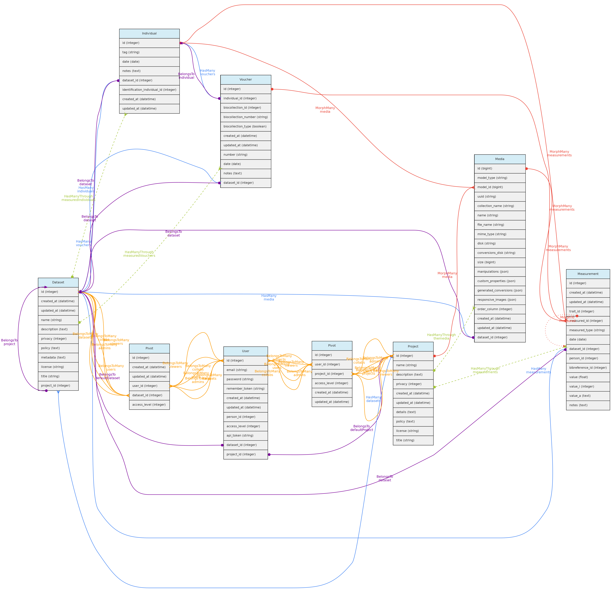
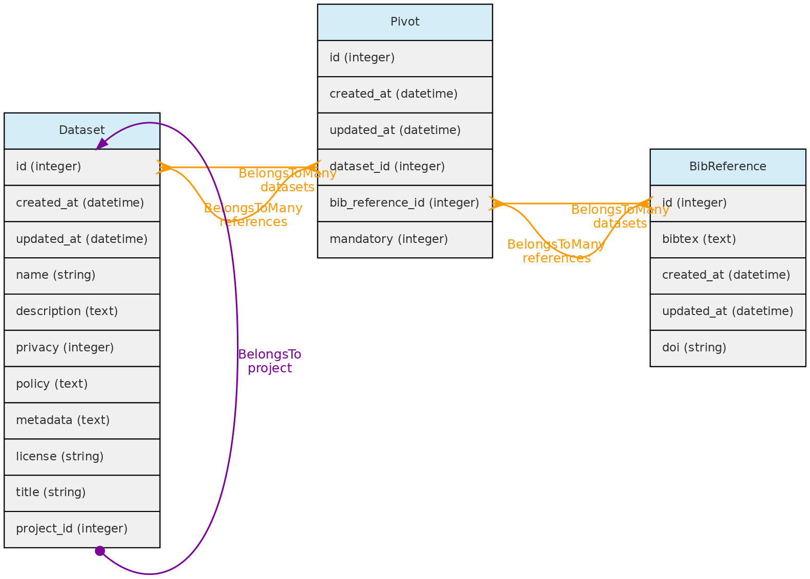
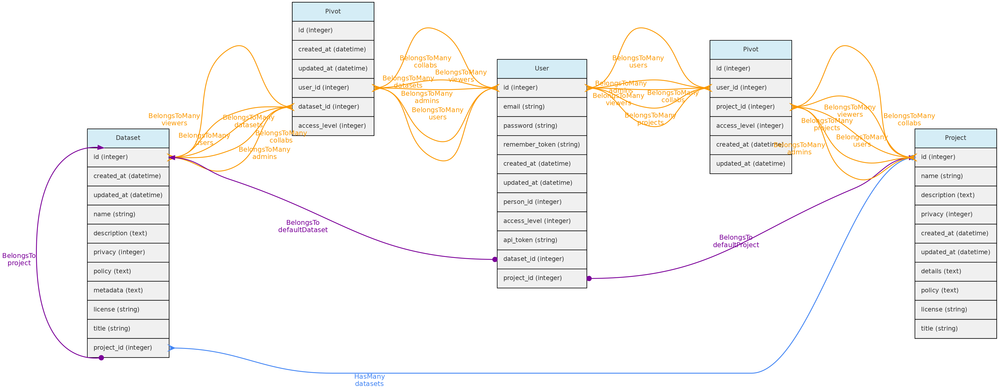
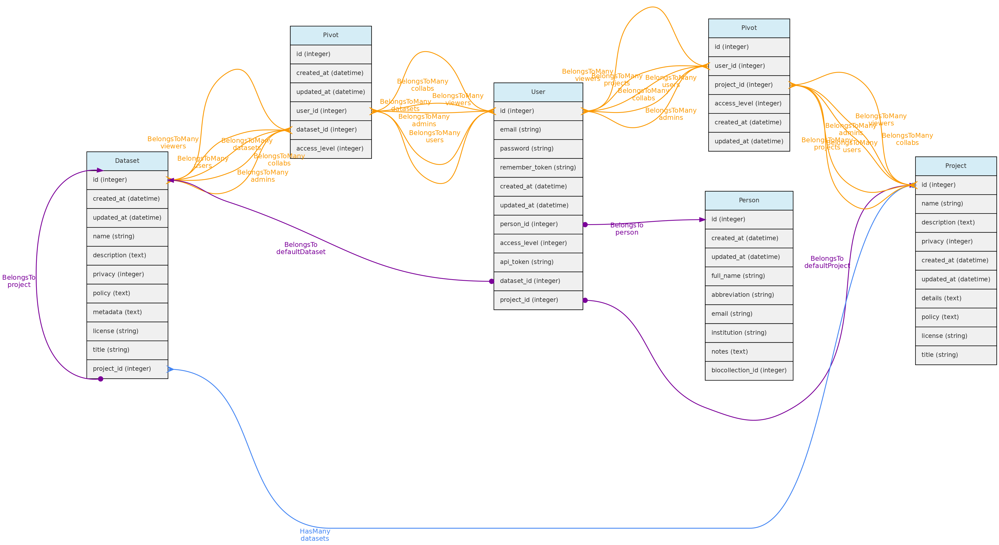
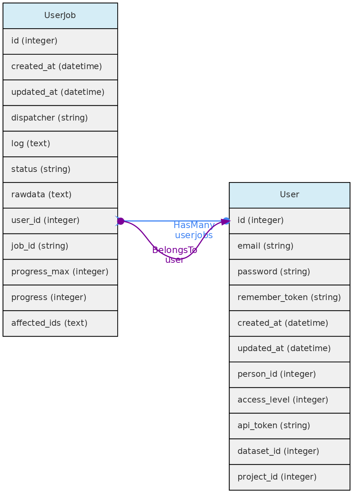

[Datasets](/docs/concepts/data-access/#dataset) control data access and represents a dynamic data publication, with a version defined by last edition date. Datasets may contain [Measurements](/docs/concepts/trait-objects/#measurement), [Individuals](/docs/concepts/core-objects/#individual), [Vouchers](/docs/concepts/core-objects/#voucher) and/or [Media Files](/docs/concepts/auxiliary-objects/#media).

[Projects](#projects) are just groups of [Datasets](/docs/concepts/data-access/#dataset) and [Users](/docs/concepts/data-access/#user), representing coohorts of users with common accessibility to datasets whose privacy are set to be controlled by a Project.

These two entities must have at least one [User](/docs/concepts/data-access/#user) defined as `administrator`, who has total control over the dataset or project, including granting the following roles to other users: `administrator`, `collaborator` or `viewer`:
* **Collaborators** are able to insert and edit objects, but are not able to delete records nor change the dataset or project configuration.
* **Viewers** have read-only access to the data that are not of open access.
* Only **Full Users** and **SuperAdmins** may be assigned as **administrators** or **collaborators**. Thus, if a user who was administrator or collaborator of a dataset is demoted to "Registered User", she or he will become a viewer.

***

## Datasets

**DataSets** are groups of [Measurements](/docs/concepts/trait-objects/#measurement), [Individuals](/docs/concepts/core-objects/#individual), [Vouchers](/docs/concepts/core-objects/#voucher) and/or [Media Files](/docs/concepts/auxiliary-objects/#media), and may have one or more [Users](/docs/concepts/data-access/#user)  `administrators`, `collaborators` or `viewers`. Administrators may set the `privacy level` to *public access*, *restricted to registered users* or *restricted to authorized users* or *restricted to project users*. This control access to the data within a dataset as exemplified in diagram below:

Datasets may also have many [Bibliographic References](/docs/concepts/auxiliary-objects/#bibreference), which together with fields `policy`, `metadata` permits to annotate the dataset with relevant information for data sharing:
    * Link any publication that have used the dataset and optionally indicate that they are of mandatory citation when using the data;
    * Define a specific data `policy` when using the data in addition to the a <a href="https://creativecommons.org/licenses/">CreativeCommons.org</a> public `license`;
    * Detail any relevant `metadata` in addition to those that are automatically retrieved from the database like the definitions of the [Traits](/docs/concepts/trait-objects/#trait) measured.

***

## Projects

**Projects** are just groups of [Datasets](/docs/concepts/data-access/#dataset) and interacts with [Users](/docs/concepts/data-access/#user), having  `administrators`, `collaborators` or `viewers`. These users may control all datasets within the Project having a *restricted to project users* access policy.

***

## Users

The **Users** table stores information about the database users and administrators. Each **User** may be associated with a default [Person](/docs/concepts/auxiliary-objects/#person). When this user enters new data, this person is used as the default person in forms. The person can only be associated to a single user.

There are three possible **access levels** for a user:
    * `Registered User` (the lowest level) - have very few permissions
    * `Full User` - may be assigned as administrators or collaborators to Projects and Datasets;
    * `SuperAdmin` (the highest level). - superadmins have have access to all objects, regardless of project or dataset configuration and is the system administrator.

Each user is assigned to the **registered user** level when she or he registers in an OpenDataBio system. After that, a **SuperAdmin** may promote her/him to Full User or SuperAdmin. SuperAdmins also have the ability to edit other users and remove them from the database.

Every registered user is created along with a restricted Project and Dataset,  which are referred to as her **user Workspace**. This allows users to import individual and voucher data before incorporating them into a larger project. [TO IMPLEMENT: export batches of objects from one project to another].

**Data Access**:users are created upon registration. Only administrators can update and delete user records.

***

## User Jobs

The **UserJob** table is used to store temporarily background tasks, such as importing and exporting data. Any user is allowed to create a job; cancel their own jobs; list jobs that have not been deleted. The **Job** table contains the data used by the Laravel framework to interact with the Queue. The data from this table is deleted when the job runs successfully. The UserJob entity is used to keep this information, along with allowing for job logs, retrying failed jobs and canceling jobs that have not yet finished.

**Data Access**: Each registered user can see, edit and remove their own UserJobs.
