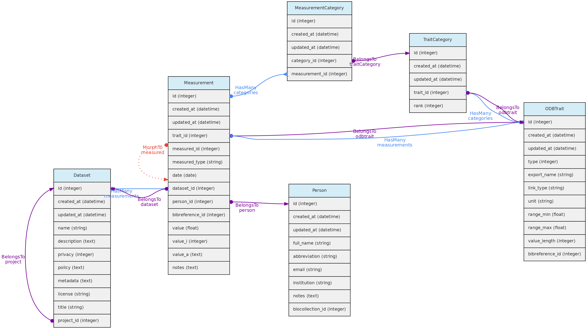
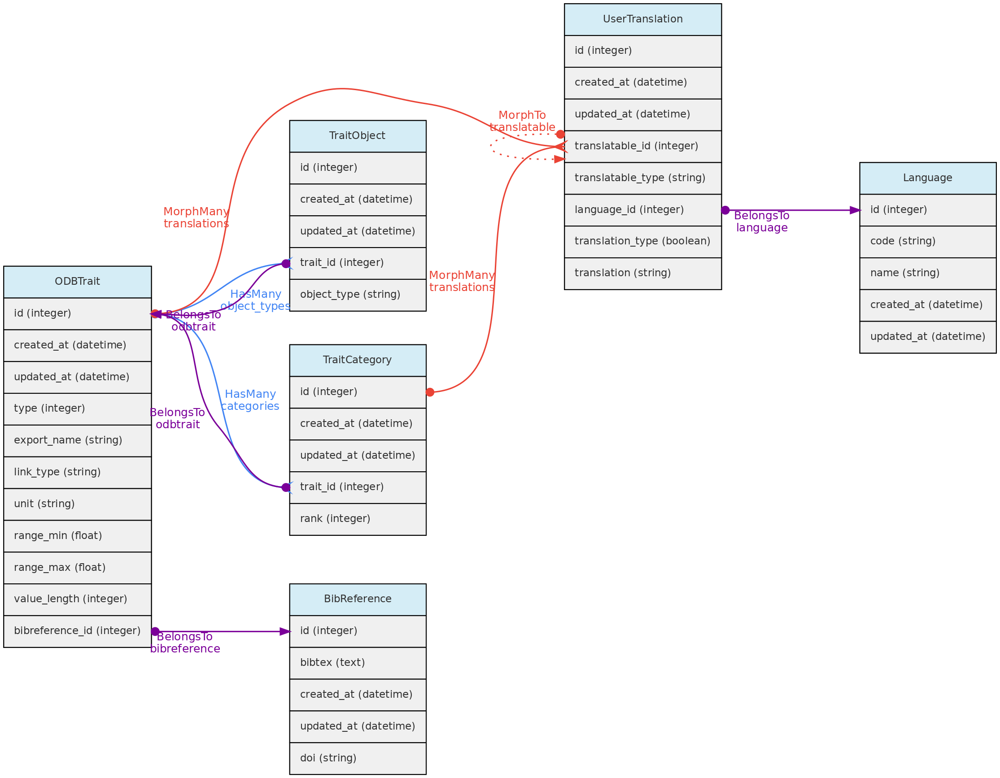

## Measurement Model
The **Measurements** table stores the values for [traits](/docs/concepts/trait-objects/#trait) measured for [core objects](/docs/concepts/core-objects). Its relationship with the core objects is defined by a [polymorphic relationship](/docs/contribution-guidelines/#polymorphicrelationships) using columns `measured_id` and `measured_type`. These MorphTo relations are illustrated and explained in the [core objects](/docs/concepts/core-objects) page.

* **Measurements** must belong to a [Dataset](/docs/concepts/data-access/#dataset) - column `dataset_id`, which controls measurement access policy
* A [Person](/docs/concepts/auxiliary-objects/#person) must be indicated as a **measurer** (`person_id`);
* The `bibreference_id` column may be used to link measurements extracted from publications to its [Bibreference](/docs/concepts/auxiliary-objects/#bibreference) source;
* The **value** for the measured trait (`trait_id`) will be stored in different columns, depending on **trait type**:
  * `value` - this float column will store values for Quantitative Real traits;
  * `value_i` - this integer column will store values for Quantitative Integer traits; and is an optional field for Link type traits, allowing for example to store counts for a species (a Taxon Link trait) in a location.
  * `value_a` - this text column will store values for Text, Color and Spectral trait types.
* Values for Categorical and Ordinal traits are stored in the `measurement_category` table, which links measurements to trait categories.
* `date` - measurement date is mandatory in all cases

**Data access** Measurements belong to [Datasets](/docs/concepts/data-access/#dataset), so Dataset access policy apply to the measurements in it. Only dataset collaborators and administrators may insert or edit measurements in a dataset, even if the dataset is of public access.

***
## Trait Model
The **ODBTrait** table represents user defined variables to collect [Measurements](/docs/concepts/trait-objects/#measurement) for one of the [core object](/docs/concepts/core-objects), either [Individual](/docs/concepts/core-objects/#individual), [Voucher](/docs/concepts/core-objects/#voucher), [Location](/docs/concepts/core-objects/#location) or [Taxon](/docs/concepts/core-objects/#taxon).

These custom traits give enormous flexibility to users to register their variables of interest. Clearly, such flexibility has a cost in data standardization, as the same variable may be registered as different Traits in any OpenDataBio installation. To minimize redundancy in trait ontology, users creating traits are warned about this issue and a list of similar traits is presented in case found by trait name comparison.

Traits have editing restrictions to avoid data loss or unintended data meaning change. So, although the Trait list is available to all users, trait definitions may not be changed if somebody else also used the trait for storing measurements.

Traits are translatable entities, so their `name` and `description` values can be stored in multiple languages (see [User Translations](/docs/concepts/auxiliary-objects/#user-translation). This is placed in the `user_translations` table through a polymorphic relationship.

The Trait definition should be as specific as needed. The measurement of tree heights using direct measurement or a clinometer, for example, may not be easily converted from each other, and should be stored in different Traits. Thus, it is strongly recommended that the Trait definition field include information such as measurement instrument and other metadata that allows other users to understand whether they can use your trait or create a new one.

* The Trait definition must include an `export_name` for the trait, which will be used during data exports and are more easily used in trait selection inputs in the web-interface. **Export names must be unique** and have no translation. Short and [camelCase](https://en.wikipedia.org/wiki/Camel_case) or [PascalCase](https://en.wikipedia.org/wiki/pascal_case) export names are recommended.
* The following trait types are available:
  * **Quantitative real** - for real numbers;
  * **Quantitative integer** - for counts;
  * **Categorical** - for one selectable categories;
  * **Categorical multiple** - for many selectable categories;
  * **Categorical ordinal** - for one selectable ordered categories (semi-quantitative data);
  * **Text** - for any text value;
  * **Color** - for any color value, specified by the hexadecimal color code, allowing renderizations of the actual color.
  * **Link** - this is a special trait type in OpenDataBio to link to database object. Currently, only link to [Taxons](/docs/concepts/core-objects/#taxon) and [Voucher](/docs/concepts/core-objects/#voucher) are  allowed as a link type traits. Use ex:  if you want to store species counts conducted in a [location](/docs/concepts/core-objects/#location), you may create a Taxon link type Trait or a Voucher link type Trait if the taxon has vouchers. A measurement for such trait will have an optional `value` field to store the counts. This trait type  may also be used to specify the host of a parasite, or the number of predator insects.
  * **Spectral** - this is designed to accommodate Spectral data, composed of multiple absorbance or reflectance values for different wavenumbers.
  * **GenBank** - this stores [GenBank](https://www.ncbi.nlm.nih.gov/genbank/) accessions numbers allowing to retrieve molecular data linked to individuals or vouchers stored in the database through the [GenBank API Service](https://www.ncbi.nlm.nih.gov/home/develop/api/). **NOT YET IMPLEMENTED**
* The Traits table contains fields that allow measurement value validation, depending on trait type:
  * `range_max` and `range_min` - if defined for Quantitative traits, measurements will have to fit the specified range;
  * `value_length` - mandatory for Spectral Traits only, validate the length (number of values) of a spectral measurement;
  * `link_type` - if trait is Link type, the measurement `value_i` must be an id of the link type object;
  * Color traits are validated in the measurement creation process and must conform to a color hexadecimal code. A color picker is presented in the web interface for measurement insertion and edition;
  * Categorical and ordinal traits will be validated for the registered categories when importing measurements through the [API](/docs/api);
* Column `unit` defines the measurement unit for the Trait. There is no way to prevent measurements values imported with a distinct unit. Quantitative traits required `unit` definition.
* Column `bibreference_id` is the key of a single [BibReference](/docs/concepts/auxiliary-objects/#bibreference) that may be linked to trait definition.
* The `trait_objects` table stores the type of [core object](/docs/concepts/core-objects) (Taxon, Location, Voucher) that the trait can have a measurement for;

**Data access** A Trait name, definition, unit and categories may not be updated or removed if there is any measurement of this trait registered in the database. The only exceptions are: (a) it is allowed to add new categories to categorical (not ordinal) traits; (b) the user updating the trait is the only Person that has measurements for the trait; (c) the user updating the trait is an Admin of all the datasets having measurements using trait.

***
## Forms

A **Form** is an organized group of [Traits](/docs/concepts/trait-objects/#trait), defined by a User in order to create a custom form that can be filled in for entering measurements through the web interface. A Form consists of a group of ordered Traits, which can be marked as "mandatory". Related entities are the **Report** and the **Filter**.

**This is still experimental and needs deeper testing**
