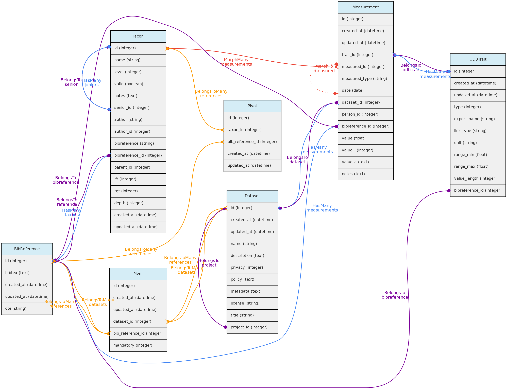
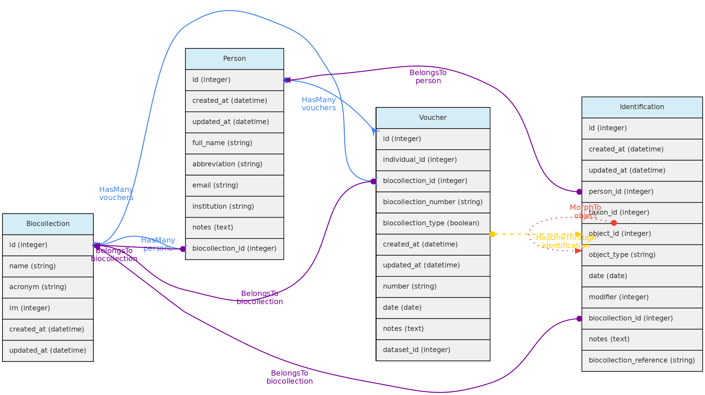
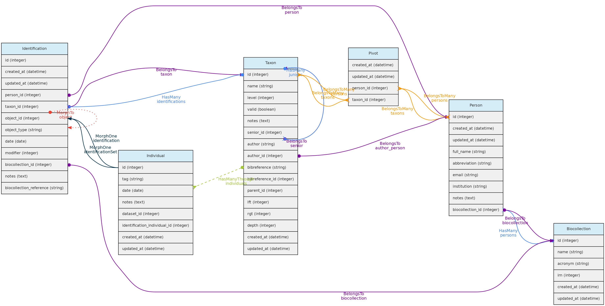
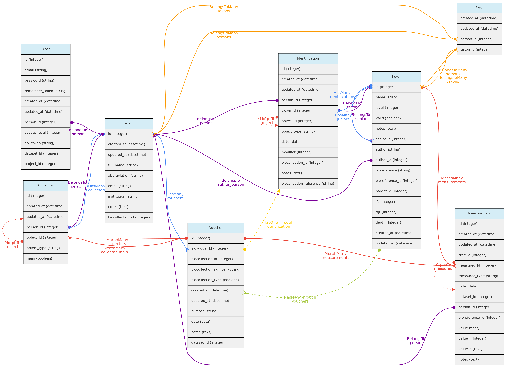
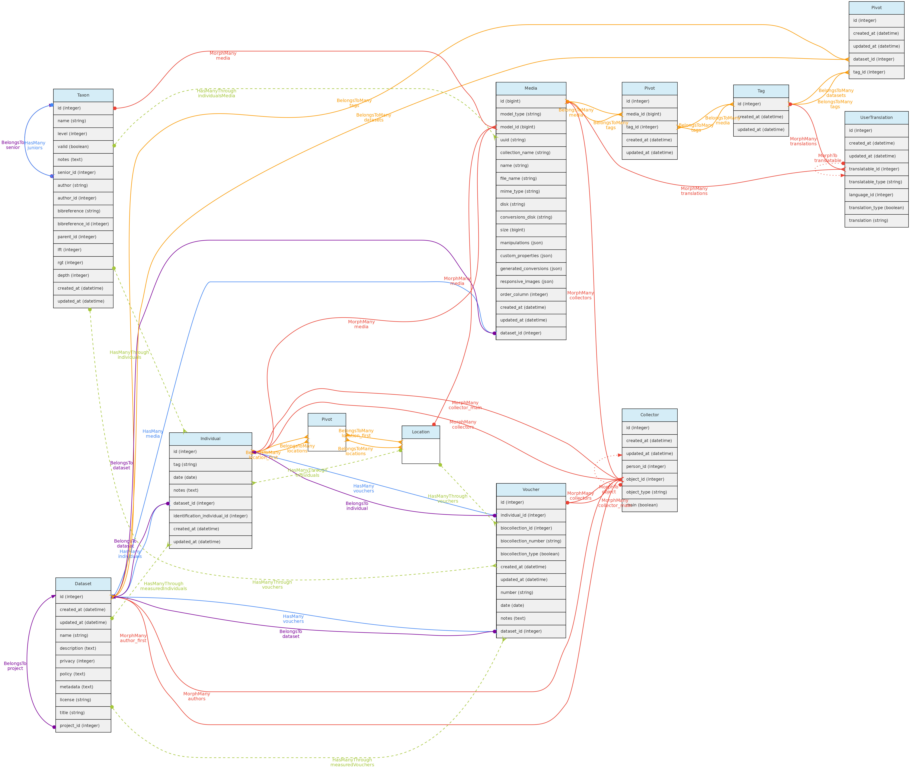
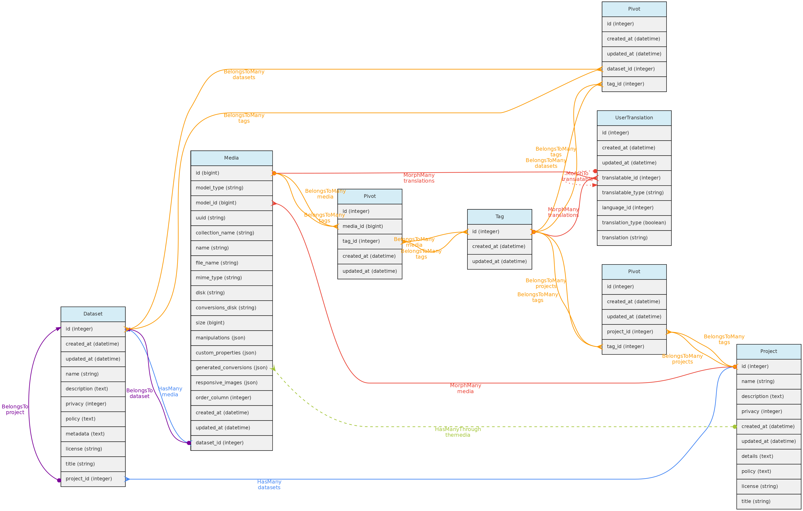
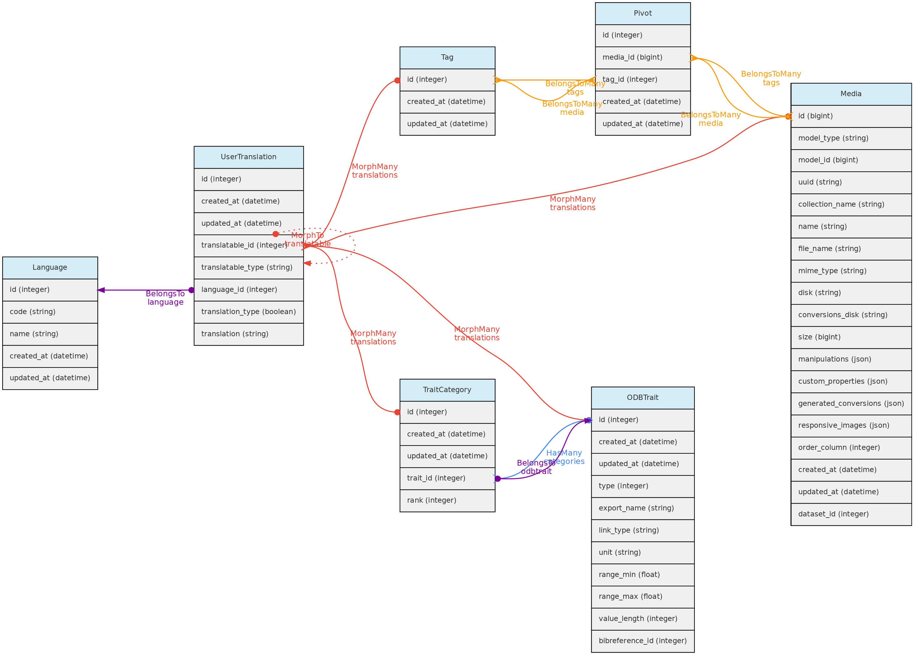
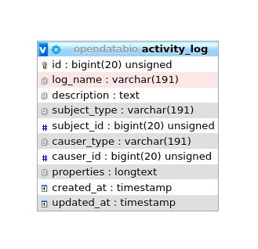

<a name="bibreference"></a>
## Referências Bibliográficas
A tabela **bib_references** contém basicamente referências formatadas em [BibTex](http://www.bibtex.org/) armazenadas na coluna `bibtex`. Você pode facilmente importar referências para o OpenDataBio através da interface, apenas especificando o `doi` ou simplesmente enviando um registro bibtex ou um arquivo *.bib*. Essas referências bibliográficas podem ser usadas para:
  * [Conjuntos de dados](/docs/concepts/data-access/#dataset) - com a opção de definir referências para as quais a citação é obrigatória quando o Conjunto de Dados for usado em publicações; mas todas as referências que usaram o conjunto de dados podem ser vinculadas ao conjunto de dados; os links são feitos com uma tabela dinâmica chamada `dataset_bibreference`;
  * [Taxons](/docs/concepts/core-objects/#taxon):
    - para especificar a referência na qual o nome do táxon foi descrito, atualmente obrigatório em algumas revistas taxonômicas como [PhytoTaxa](https://www.mapress.com/j/pt/). Esta referência de descrição é armazenada no `bibreference_id` da tabela Taxons.
    - para registrar qualquer referência a um nome de táxon, que são então vinculados por meio de uma tabela dinâmica chamada `taxons_bibreference`.
  * Vincule uma [Medição](/docs/concepts/trait-objects/#measurement) a uma fonte publicada;
  * Indique a origem de uma definição de [Variável](/docs/concepts/trait-objects/#trait).
  * Indique citações obrigatórias para um conjunto de dados ou vincule referências usando os dados para um conjunto de dados


*O modelo BibReference e seus relacionamentos. As linhas que ligam as tabelas indicam os `métodos` implementados, com cores indicando diferentes relacionamentos*

### Tabela Bibreferences
- A `bibtexKey`, autores e outros campos relevantes são extraídos do registro em formato bibtex armazenado na coluna `bibtex`.
- A ** bibtexkey deve ser única** no banco de dados e uma função auxiliar é fornecida para padronizá-la com o formato `<von? sobrenome> <ano> <primeira palavra do título>`. A "parte von" do nome é "von", "di", "de la", que fazem parte do sobrenome de alguns autores. A primeira palavra do título ignora palavras de interrupção comuns, como "a", "o" ou "em".
- [DOI](https://www.doi.org/) para uma referencia pode ser especificado no campo BibTex relevante ou em uma entrada de texto separada, e são armazenados no campo `doi` quando presente. Uma API externa encontra o registro bibliográfico quando um usuário informa o `doi` na interface.

<br>
 **Acesso a dados** [usuários completos](/docs/concepts/data-access/#user) podem registrar novas referências, editar detalhes de referências e remover registros de referência que não têm dados associados. BibReferences tem acesso público!

***
<a name="biocollection"></a>
## BioColeções
O modelo **Biocollection** atualmente armazena apenas informações básicas sobre Coleções Biológicas que podem ser usadas para [Vouchers](/docs/concepts/core-objects/#voucher) para indicar em quais Coleções Biológicas o voucher foi depositado. O objeto Biocollection pode ser uma Coleção Biológica formal, como as registradas no [Index Herbariorum](http://sweetgum.nybg.org/science/ih/), ou qualquer outra Coleção Biológica, formal ou informal.

O objeto Biocollection também interage com o modelo [Person](/docs/concepts/auxiliary-objects/#person). Quando uma Pessoa está vinculada a uma Biocoleção, ela será listada como especialista taxonômico e pode ter também um vínculo com Taxons.

 Atualmente ODB usa o modelo BioCollection apenas para anotar em que coleção Vouchers estão depositados. Planejamos incluir elementos para permitir que curadores gerenciem seus acervos, como rastreamento de empréstimos, doações, qualidade, etc.




**Acesso a dados** - apenas usuários administradores podem registrar novas biocoleções e excluir biocoleções não utilizadas. As atualizações ainda não foram implementadas.

***
<a name="identification"></a>
## Identificação Taxonômica

O modelo **Identificação** representa a identificação taxonômica de [Indivíduos](/docs/concepts/core-objects/#individual).


*Modelo de identificação e suas relações. Linhas ligando tabelas indicam os `métodos` implementados, com cores indicando diferentes relacionamentos do Laravel Eloquent*

### Tabela identifications
* O modelo de Identificação inclui vários campos opcionais, mas além de `taxon_id`,` person_id`, a [Pessoa](/docs/concepts/auxiliary-objects/#person)responsável pela identificação e a `date` de identificação são obrigatórios.
- O valor de `date` pode ser uma [Data Incompleta](/docs/concepts/auxiliary-objects/#incomplete-date), por exemplo apenas o ano ou ano + mês podem ser registrados.
* Os seguintes campos são opcionais:
  * `modifier` - é um código numérico que anexa um modificador taxonômico ao nome. Valores possíveis 's.s.' = 1, 's.l.' = 2, 'cf.' = 3, 'aff.' = 4, 'vel aff.' = 5, o padrão é 0 (nenhum).
  * `notes` - um texto de escolha, útil para adicionar comentários à identificação.
  * `biocollection_id` e` biocollection_reference` - esses campos devem ser usados ​​para indicar que a identificação é baseada na comparação com um voucher depositado em uma coleção biológica e cria um link entre o indivíduo identificado e o espécime da BioColeção no qual a identificação foi baseada. `biocollection_id` armazena o id de [BioColeção](/docs/concepts/data-access/#biocollection)  e `biocollection_reference` o identificador único do espécime comparado, ou seja, seria o equivalente ao `biocollection_number` do modelo Voucher, mas esta referência não precisa ser de um voucher registrado no banco de dados.
* O relacionamento com o modelo individual é definido por [relações polimórficas](/docs/contribution-guidelines/#polymorphic-relationships) usando os campos `object_type` e `object_id`. [Na estrutura atual, isso pode ser substituído por um 'individual_id' na tabela de identificação. A relação polimórfica foi herdada de uma versão anterior de desenvolvimento e foi mantida porque o modelo de Identificação poderá ser necessário para vincular outros objetos].
* Mudanças na Identificação de Indivíduos são [auditadas](/docs/concepts/auxiliary-objects/#auditing) para rastrear o histórico de mudanças

 **Acesso aos dados**: as identificações são atributos dos Indivíduos e não possuem acesso independente!

***
<a name="person"></a>
## Pessoas

O modelo **Persons** armazena nomes de pessoas que podem ou não ser um [Usuário](/docs/concepts/data-access/#user) diretamente envolvido com a base de dados. Pessoas podem ser:
    * **coletores** de [Vouchers](/docs/concepts/core-objects/#voucher), [Indivíduos](/docs/concepts/core-objects/#individual) e  [Arquivos de Mídia](/docs/concepts/auxiliary-objects/#media)
    * **identificadores taxonômicos** de [Indivíduos](/docs/concepts/core-objects/#individual);
    * **medidores** de [Medições](/docs/concepts/trait-objects/#measurement);
    * **autores** para nomes  *não publicados*  de [Taxons](/docs/concepts/core-objects/#taxon);
    * **especialistas taxonômicos** - ligados ao modelo Taxon pela tabela `person_taxon`;
    * **autores de Conjuntos de Dados**


*Modelo Persons e seus relacionamentos. As linhas que ligam as tabelas indicam os `métodos` implementados, com cores indicando diferentes tipos de métodos do Laravel Eloquent, linhas sólidas as relações diretas e tracejadas as indiretas*

### Tabela persons
- as colunas obrigatórias são a pessoa `full_name` e` abbreviation`;
- ao cadastrar uma nova pessoa, o sistema sugere o nome `abbreviation`, mas o usuário é livre para alterá-lo para melhor adaptá-lo à abreviatura usual de cada pessoa. A ** abreviatura deve ser única ** no banco de dados, duplicatas não são permitidas na tabela Pessoas. Portanto, duas pessoas com exatamente o mesmo nome devem ser diferenciadas de alguma forma na coluna `abbreviation`.
- A coluna `biocollection_id` da tabela Pessoas é usada para listar a qual [BioColeção](/docs/concepts/data-access/#biocollection) uma pessoa está associada, que pode ser usada quando a Pessoa também é um especialista taxonômico.
- Adicionalmente, também podem ser informados o `e-mail` e a` institution` a que pertence a pessoa.
- Cada usuário pode ser vinculado a uma pessoa pelo `person_id` na tabela Usuário. Essa pessoa é então usada como a pessoa 'padrão' quando o usuário está logado no sistema.

<br>
**Acesso a dados** [usuários completos](/docs/concepts/data-access/#user) podem registrar novas pessoas e editar as pessoas inseridas e remover pessoas que não possuem dados associados. Os administradores podem editar qualquer pessoa. A lista de pessoas tem acesso público.

***
<a name="media"></a>
## Arquivos de Mídia
**Arquivos de mídia** são semelhantes a [Medições](/docs/concepts/trait-objects/#measurement) no sentido de que podem estar associados a qualquer [objeto central](/docs/concepts/core-objects). Os arquivos de mídia podem ser imagens (jpeg, png, gif, tif), arquivos de vídeo ou áudio e podem ser disponibilizados gratuitamente ou colocados em um [Conjuntos de dados](/docs/concepts/data-access/#dataset) com uma política de acesso definida. Uma licença [CreativeCommons.org](https://creativecommons.org/licenses/) pode ser atribuída a eles. Os arquivos de mídia podem ser **anotados**, ou seja, você pode definir palavras-chave para eles, permitindo consultá-los por [Tags](/docs/concepts/auxiliary-objects/#tag). Por exemplo, uma imagem individual pode ser marcada com 'flores' ou 'frutos' para indicar o que está na imagem, ou uma tag que informa sobre a qualidade da imagem.



* Os arquivos de mídia (imagem, vídeo, áudio) são vinculados aos [objetos centrais](/docs/concepts/core-objects) por meio de uma [relações polimórfica](/docs/contribution-guidelines/#polymorphic-relationships)  definida pelas colunas `model_id` e` model_type`.
* Múltiplas [Pessoas](/docs/concepts/auxiliary-objects/#person) podem ser associadas à Mídia para créditos, eles estão vinculados à tabela **collectors**, também através de relações polimóficas.
* Uma Mídia pode ter uma `description` em cada idioma configurado na tabela languages, que será armazenada na tabela `user_translations`. As entradas para cada idioma são mostradas nos formulários da interface.
* Os arquivos de mídia não são armazenados no banco de dados, mas na pasta de armazenamento do servidor.
* É possível **fazer upload em lote de arquivos de mídia** por meio da interface web, exigindo também um arquivo informando os objetos aos quais vincular a mídia e os metadados.


**Acesso a dados** [usuários completos](/docs/concepts/data-access/#user)  podem registrar arquivos de mídia e excluir aqueles que eles inseriram. Se a mídia estiver em um conjunto de dados, os administradores do conjunto de dados podem excluir a mídia além do usuário. Os arquivos de mídia têm acesso público, exceto quando vinculados a um conjunto de dados com restrições de acesso.

***
<a name="tag"></a>
## Tag Model
O modelo **Tag** permite que os usuários definam **palavras-chave traduzíveis** que podem ser usadas para sinalizar [Conjuntos de dados](/docs/concepts/data-access/#dataset), [Projetos](/docs/concepts/data-access/#project) ou [Arquivos de Mídia](/docs/concepts/auxiliary-objects/#media). O modelo Tag está vinculado a esses objetos por meio de uma tabela para cada um, denominada `dataset_tag`,` project_tag` e `media_tag`, respectivamente.

Um Tag pode ter `name` e` description` em cada idioma configurado na tabela de Idiomas, que serão armazenados na tabela `user_translations`. As entradas para cada idioma são mostradas nos formulários da interface.



**Acesso a dados** [usuários completos](/docs/concepts/data-access/#user) podem registrar tags, editar as inseridas e excluir as que não foram usadas. As tags têm acesso público, pois são apenas palavras-chave para facilitar a navegação.

***
<a name="user-translation"></a>
## Traduções do usuário

O modelo **UserTranslation** armazena as traduções de dados do usuário para: descrições e nomes de [Variáveis](/docs/concepts/trait-objects/#trait) e de categorias para variáveis categóricas; descrições de [Arquivos de Mídia](/docs/concepts/auxiliary-objects/#media) e para [Tags](/docs/concepts/auxiliary-objects/#media). As relações com esses modelos são estabelecidas por [relações polimórfica](/docs/contribution-guidelines/#polymorphic-relationships) usando os campos `translatable_type` e` translatable_id`. Este modelo permite traduções para qualquer idioma listado na tabela **languages**, atualmente acessível apenas para inserção e edição diretamente no banco de dados SQL. Os formulários de entrada na interface web serão listados para os idiomas registrados.



***
<a name="incomplete-date"></a>
## Datas incompletas
Datas para [Vouchers](/docs/concepts/core-objects/#voucher), [Indivíduos](/docs/concepts/core-objects/#individual), [Medições](/docs/concepts/trait-objects/#measurement) e [Identificações](/docs/concepts/auxiliary-objects/#identification) podem ser incompletas, mas pelo menos **ano** é obrigatório em todos os casos. As colunas `date` nas tabelas são do tipo 'date' e as datas incompletas são armazenadas com 00 na parte ausente: '2005-00-00' quando apenas o ano é conhecido; '1988-08-00' quando apenas o mês é conhecido.

***
<a name="auditing"></a>
## Auditando mudanças
As modificações nos registros do banco de dados são registradas na tabela **activity_log**. Esta tabela é gerada pelo pacote [ActivityLog](https://github.com/spatie/laravel-activitylog). As atividades são mostradas em um link 'Histórico' fornecido no show.view dos modelos.
1. O pacote armazena as alterações como json no campo `properties`, que contém dois elementos:` attribute` e `old`, que são basicamente os valores novos vs antigos que foram alterados. Essa estrutura deve ser respeitada.
1. A classe **ActivityFunctions** contém funções personalizadas para ler as propriedades do registro Json armazenado na tabela `activity_log` e encontra os valores para mostrar na tabela de dados History;
1. A maioria das mudanças são registradas pelo pacote como um 'trait' chamada dentro da classe. Estes permitem registrar automaticamente a maioria das atualizações e são configurados para registrar apenas os campos que foram alterados, não registros inteiros (opção `dirty`). Além disso, a criação de registros não é anotada como atividade, apenas as alterações.
1. Algumas alterações, como de coletores e de identificações indivíduos são registradas separadamente, pois envolvem tabelas relacionadas e o registro é especificado nos arquivos do Controlador;
1. O registro contém um campo `log_name` que agrupa os tipos de registro e é usado para distinguir os tipos de atividade e é útil para pesquisar a tabela de dados do histórico;
1. Dois registros especiais também são feitos para Conjuntos de Dados:
  1. Qualquer download de um Conjunto de Dados pela interface é registrado, então os administradores podem rastrear quem e quando o conjunto de dados foi baixado;
  1. Qualquer solicitação de conjunto de dados também é registrada pelo mesmo motivo

**O `clean-command` do pacote NÃO DEVE ser usado durante uma instalação em produção, caso contrário, apagará todas as alterações registradas**. Se executado, apagará os logs anteriores ao tempo especificado no arquivo `/config/activitylog.php`.

<br>
A tabela ActivityLog tem a seguinte estrutura:


* `causer_type` e` causer_id` serão o [usuário](/docs/concepts/data-access/#user) que fez a alteração
* `subject_type` e` subject_id` serão o modelo e registro alterados
* `log_name` - para agrupar logs e permite consultas
* `description` - um tanto redundante com log_name em um contexto OpenDataBio.
* `properties` - armazena as mudanças, por exemplo, e a mudança de identificação terá um log como:

```JSON
{
    "attributes":
    {
        "person_id":"2",
        "taxon_id":"1424",
        "modifier":"2",
        "biocollection_id":"1",
        "biocollection_reference":"1234",
        "notes":"A new fake note has been inserted",
        "date":"2020-02-08"},
    "old":{
        "person_id":674,
        "taxon_id":1413,
        "date":"1995-00-00",
        "modifier":0,
        "biocollection_id":null,
        "notes":null,
        "biocollection_reference":null
    }
}

```
