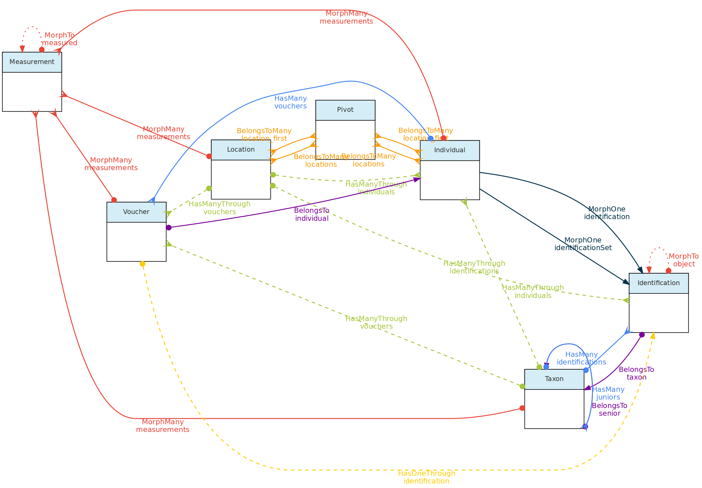
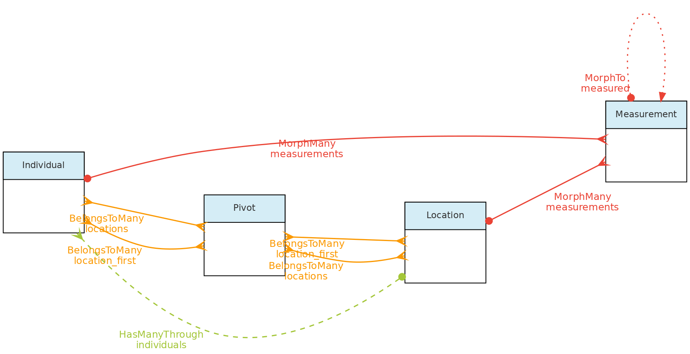
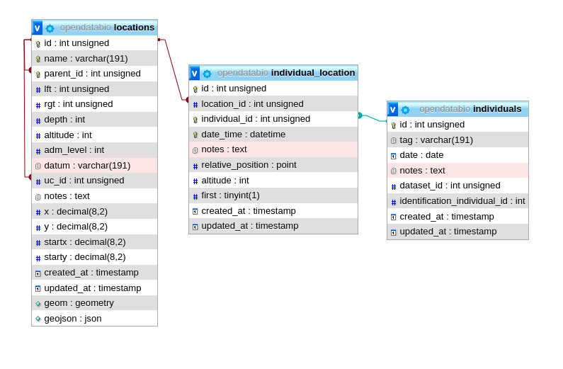
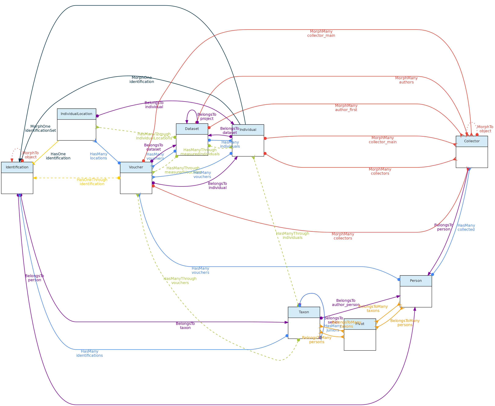
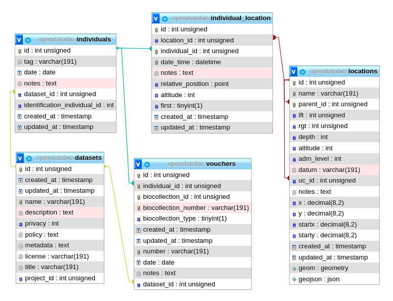
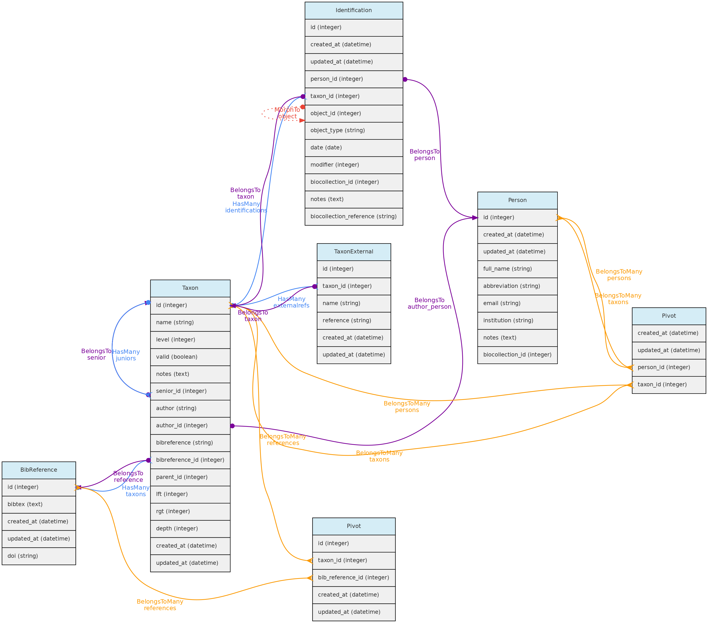
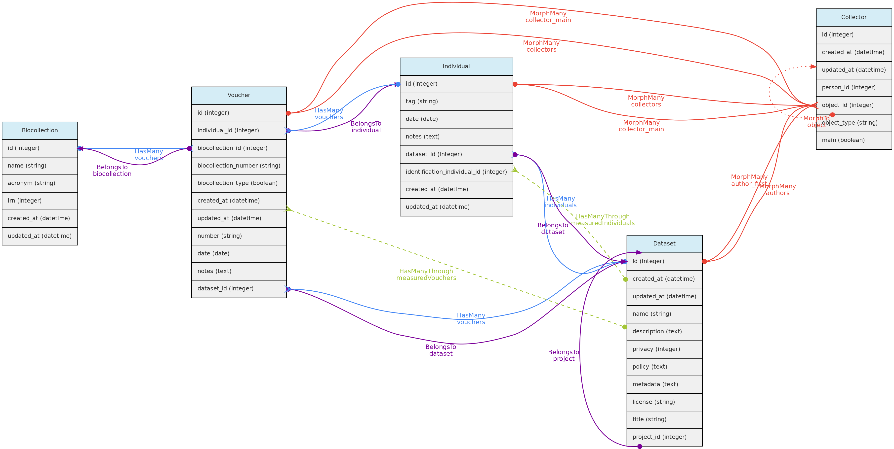

Os objetos centrais são: [Localidades](/docs/concepts/core-objects/#location), [Vouchers](/docs/concepts/core-objects/#voucher), [Indivíduos](/docs/concepts/core-objects/#individual) e [Taxons](/docs/concepts/core-objects/#taxon). Essas entidades são consideradas "centrais" porque podem receber [Medições](/docs/concepts/trait-objects/#measurement), ou seja, você pode registrar valores para qualquer [Variável](/docs/concepts/trait-objects/#trait).

* O objeto [Indivíduo](/docs/concepts/core-objects/#individual) refere-se a um organismo individual que foi observado uma vez (uma ocorrência) ou foi marcado para monitoramento, como uma árvore em uma parcela permanente, uma ave anilhada, um morcego rastreado por rádio. Os indivíduos podem ter um ou mais [Vouchers](/docs/concepts/core-objects/#voucher) em uma [BioColeção](/docs/concepts/auxiliary-objects/#biocollection) e um ou vários [Localidades](/docs/concepts/core-objects/#location) e terão uma [Identificação taxonômica](/docs/concepts/auxiliary-objects/#identification). Qualquer atributo medido ou tomado para um individuo pode ser associado a este objeto por meio do modelo [Medição](/docs/concepts/trait-objects/#measurement).

* O objeto [Vouchers](/docs/concepts/core-objects/#voucher)  é para registros de espécimes coletados de [Indivíduo](/docs/concepts/core-objects/#individual) e depositados em uma [BioColeção](/docs/concepts/auxiliary-objects/#biocollection). A identificação taxonômica e a localização de um voucher é aquela do próprio indivíduo a que pertence. [Medições](/docs/concepts/trait-objects/#measurement) podem ser vinculadas a um Voucher quando você deseja registrar explicitamente os dados para aquela amostra específica (por exemplo, medições morfológicas; um marcador molecular de uma extração de uma amostra em um coleta de tecido). Caso contrário, você pode simplesmente registrar a medição para o indivíduo ao qual o voucher pertence. O modelo de voucher também está disponível como tipo especial de [Variável](/docs/concepts/trait-objects/#trait), o `LinkType`, tornando possível registrar contagens para o táxon do voucher em um determinado local.

* O objeto [Localidades](/docs/concepts/core-objects/#location) contém geometrias espaciais, como pontos e polígonos, e inclui `parcelas` e` transectos` como casos especiais. Um [Indivíduo](/docs/concepts/core-objects/#individual)  pode ter uma localidade (por exemplo, uma planta) ou multiplas localidades (por exemplo, um animal monitorado). As localidades do tipo PARCELA e TRANSECTO podem ser registradas como geometria espacial ou apenas com geometria de ponto, e podem ter dimensões cartesianas (metros) registradas. Os indivíduos também podem ter posições cartesianas (X e Y ou angle e distance) em relação à sua Localidade, permitindo contabilizar o mapeamento tradicional de indivíduos em unidades de amostragem. Medições ecológicas relevantes, como dados de solo ou clima, são exemplos de [Medições](/docs/concepts/trait-objects/#measurement) que podem ser vinculadas a localidades.

* O objeto [Taxon](/docs/concepts/core-objects/#taxon), além de seu uso para a [Identificação taxonômica](/docs/concepts/auxiliary-objects/#identification) de Indivíduos, pode receber [Medições](/docs/concepts/trait-objects/#measurement), permitindo a organização de dados secundários publicados ou qualquer tipo de informação ligada a um nome taxonômico. Uma [Referência Bibliográfica](/docs/concepts/auxiliary-objects/#bibreference) pode ser incluída para indicar a fonte de dados. Além disso, o modelo Taxon está disponível como tipo especial de [Variável](/docs/concepts/trait-objects/#trait), o `LinkType`, tornando possível registrar contagens de Taxons em um determinado local.

 

*Esta figura mostra as relações entre os `objetos centrais` e com o modelo [Medições](/docs/concepts/trait-objects/#measurement). O [Identificação](/docs/concepts/auxiliary-objects/#identification)  também está incluído para maior clareza. Links sólidos são relacionamentos diretos, enquanto links tracejados são relacionamentos indiretos (por exemplo, os táxons têm muitos vouchers por meio de indivíduos e muitos indivíduos por meio de identificações). As linhas sólidas vermelhas vinculam os `Objetos centrais` com o modelo de Medição por meio de [relações polimórficas](/docs/contribution-guidelines/#polymorphic-relationships). As linhas pontilhadas no modelo de Medição apenas permitem o acesso ao objeto central medido e aos modelos de variáveis do tipo de link.*

 
 

***
## Localidades

O modelo **Localidades** armazena dados que representam locais do mundo real. Eles podem ser países, cidades, unidades de conservação ou qualquer polígono espacial, ponto ou trilha na superfície da Terra. Esses objetos são hierárquicos e possuem um relacionamento pai-filho implementado pelo Nested Set Model para dados hierárquicos da biblioteca Laravel [Baum](https://github.com/etrepat/baum) que facilita tanto a validação quanto as consultas.

Tipos de Localidades especiais são `parcelas` e` transectos`, que juntamente com  `pontos` permitem diferentes métodos de amostragem usados ​​em estudos de biodiversidade. Esses tipos de Localidades também podem ser vinculados a uma localidade administrativa pai e, além disso, a três tipos adicionais de localidades pai como `Unidades de Conservação`,` Territórios Indígenas` e qualquer camada `Ambiental` representando classes de vegetação, classes de solo , etc ... com geometrias espaciais definidas.
Indivíduo

*Esta figura mostra os relacionamentos do modelo `Location` através dos métodos implementados nas classes mostradas. A tabela dinâmica que vincula Localidade a Indivíduos permite que um indivíduo tenha vários locais e cada local para o indivíduo tenha atributos específicos como date_time, altitude, relative_position e notes.*
  

*As mesmas tabelas relacionadas com o modelo `Location` com as relações diretas e não polimórficas indicadas*.

### Tabela locations
- As colunas `parent_id` junto com` rgt`, `lft` e` deph` são usadas para definir o modelo de conjunto aninhado para consultar ancestrais e descendentes de forma rápida. Apenas `parent_id` é especificado pelo usuário, as outras colunas são calculadas pela biblioteca Baum a partir dos valores id+parent_id que definem a hierarquia. O mesmo modelo hierárquico é usado para o [Taxons](/docs/concepts/core-objects/#taxon), mas para locais há uma **restrição espacial**, ou seja, um filho deve estar dentro de uma geometria pai.
- A coluna `adm_level` indica o nível administrativo, ou tipo, de localidade. Por padrão, os seguintes `adm_level` são configurados no OpenDataBio:
    - `2` para o país,` 3` para a primeira divisão dentro do país (província, estado), `4` para a segunda divisão (por exemplo, município), ... até` adm_level = 10` como áreas administrativas (o código do país é 2 para permitir a padronização com [OpenStreeMaps](https://wiki.openstreetmap.org/wiki/Tag:boundary%3Dadministrative#admin_level.3D.2A_Country_specific_values), que é recomendado seguir se sua instalação incluir dados de diferentes países). Os níveis administrativos podem ser configurados em um OpenDataBio **antes** de importar quaisquer dados para o banco de dados, consulte o [guia de instalação](/docs/getting-started) para obter detalhes sobre isso.
    - `99` é o código para *Unidades de Conservação* - uma unidade de conservação é uma `location` que pode estar vinculada a vários outros locais (qualquer local pode pertencer a uma única UC). Assim, uma localidade pode ter como pai um município e como uc a unidade de conservação a que pertence.
    - `98` é o código para *Territórios Indígenas* - mesmas propriedades das Unidades de Conservação, mas tratadas separadamente apenas porque algumas UCs ​​e TIs podem se sobrepor amplamente como é o caso da região amazônica
    - `97` é o código para *Camadas ambientais* - mesmas propriedades das Unidades de Conservação e Territórios Indígenas, ou seja, podem ser vinculadas como localidade pai adicional a qualquer Ponto, Parcela ou Transecto e, portanto, seus indivíduos relacionados. Armazene polígonos e geometrias de multipolígonos representando classes ambientais, como unidades de vegetação, biomas, classes de solo, etc ...
    - `100` é o código para `parcelas` e `sub-parcelas` - as localidades de tipo parcelas podem ser registradas com geometria de ponto ou polígono, e também devem ter dimensões cartesianas associadas em metros. Se for uma localização de ponto, a geometria é definida a partir do ponto informado. As dimensões cartesianas de uma localidade de tipo parcela também podem ser combinadas com posições cartesianas de subparcelas (ou seja, uma localidade de parcela cujo pai também é uma localidade de parcela) e/ou de indivíduos dentro de tais parcelas, permitindo que indivíduos e subparcelas sejam mapeados dentro de uma subparcela sem especificações de geometria. Em outras palavras, se a geometria espacial da Parcela for desconhecida, ela pode ter como geometria um único ponto GPS ao invés de um polígono, mais suas dimensões `x` e` y`. Uma subparcela é uma parcela cuja localidade pai também é uma parcela, e deve consistir em um ponto marcando o início da subparcela mais suas dimensões cartesianas X e Y. Se a geometria do início da subplot for subparcela, ela pode ser armazenada como uma posição relativa à parcela pai usando `startx` e` starty`.
    - `101` para transectos - como parcelas, os transectos podem ser registrados tendo uma geometria LineString ou simplesmente uma única coordenada de Latitude e Longitude e uma dimensão. A dimensão cartesiana `x` para transectos representa o comprimento em metros e é usada para criar linha (orientada para o Norte) quando apenas um ponto é informado. A dimensão `y` é usada para validar os indivíduos como pertencentes à uma localidade do tipo transecto e representa a distância máxima da linha que um indivíduo deve cair para ser detectado naquele local.
    - `999` para localidades 'POINT' como waypoints GPS - isto é para registro de qualquer ponto no espaço
- A coluna `datum` pode registrar a propriedade do datum da geometria, se conhecida. Se deixado em branco, o local é considerado armazenado usando o datum [WGS84](https://en.wikipedia.org/wiki/World_Geodetic_System). Porém, não há conversor embutido de outros tipos de dados. Portanto os mapas exibidos podem ficar incorretos se diferentes projeções forem usadas. **Fortemente** recomendado projetar dados como WSG84 para padronização.
- A coluna `geom` armazena a geometria da localização no banco de dados, permitindo consultas espaciais em linguagem SQL, como` detecção das localidades pai`. A geometria de um local pode ser `POINT`,` POLYGON`, `MULTIPOLYGON` ou` LINESTRING` e deve ser formatada usando [Well-Known-Text](https://en.wikipedia.org/wiki/Well-known_text) representação geométrica da localidade. Quando um POLYGON é informado, o **primeiro ponto dentro da string geométrica é privilegiado**, ou seja, pode ser utilizado como referência para marcações relativas. Por exemplo, tal ponto será a referência para as colunas `startx` e` starty` de uma subparcela. Portanto, para as geometrias `plot` e` transect`, importa qual ponto é listado primeiro na geometria WKT

**Acesso a dados** [usuários completos](/docs/concepts/data-access#user) podem registrar novas Localidades, editar detalhes de Localidades e remover registros de Localidades que não têm dados associados. As Localidades têm acesso público.

***

## Indivíduos

O objeto **Indivíduo** representa um registro para um organismo individual. Pode ser uma única ocorrência no espaço-tempo de um animal, planta ou fungo, ou um indivíduo monitorado ao longo do tempo, como uma planta em parcela florestal permanente, ou um animal de captura-recaptura ou rádio-rastreamento.

Um **Indivíduo** pode ter um ou mais [Vouchers](/docs/concepts/core-objects/#voucher) representando amostras físicas do indivíduo armazenadas em uma ou mais [BioColeção](/docs/concepts/auxiliary-objects/#biocollection) e pode ter um ou mais [Localidades](/docs/concepts/core-objects/#location), representando o local ou locais onde o indivíduo foi registrado.

Indivíduos também podem ter uma [Identificação taxonômica](/docs/concepts/auxiliary-objects/#identification), que pode ser **própria** ou pode depender da identificação de outro indivíduo (**identificação-dependente**). A identificação é herdada por todos os Vouchers registrados para o Indivíduo. Portanto, os vouchers não têm sua identificação própria.

*Esta figura mostra o Modelo Indivíduo e os modelos aos quais ele se relaciona, exceto os modelos de Medição e Localidades, já que seus relacionamentos com Indivíduos são mostrados em outra parte desta página. As linhas indicam os `métodos` ou funções implementadas nas classes para acessar os relacionamentos. As linhas tracejadas indicam relações indiretas e as cores os diferentes tipos de métodos do Laravel Eloquent.*

*As mesmas tabelas relacionadas com o modelo Indivíduo, suas colunas e as relações diretas e não polimóficas entre elas*.

### Tabela individuals
- Um registro de um Indivíduo **deve** especificar pelo menos uma [Localidade](/docs/concepts/core-objects/#location) onde foi registrado, a `date` do registro, o identificador local `tag` e o `collectors` do registro e o` dataset` ao qual o indivíduo pertence.
- A localidade pode ser qualquer localidade cadastrado, independente do nível, permitindo armazenar registros históricos cujo georreferenciamento é apenas um local administrativo. Localidades  são armazenadas na tabela  `individual_location`, tendo colunas` date_time`, `altitude`,`notes` e `relative_position`.
- A coluna `relative_position` armazena as coordenadas cartesianas do Indivíduo em relação à sua localidade. Isso é apenas para indivíduos localizados em locais do tipo `plot`,` transect` ou `point`. Por exemplo, uma parcela com dimensões de 100x100 metros (1ha) pode ter um indivíduo com `posição relativa = PONTO (50 50)`, que colocará o indivíduo no centro do local (isso é mostrado graficamente na interface da web conforme definido pelas coordenadas `x` e` y` do indivíduo). Se a localidade for uma subparcela, a posição dentro da parcela pai também pode ser calculada (isso foi projetado com as parcelas do ForestGeo em mente e é uma coluna na [API individual GET](/docs/api/get-data/#individuals-endpoint). Se a localidade for um PONTO, a posição_relativa pode ser informada como `angle` (= azimute) e `distance`, atributos frequentemente medidos em métodos de amostragem. Se a localidade for um TRANSECT, a posição_relativa posiciona o indivíduo em relação à linha, sendo `x` a distância ao longo do transecto a partir do primeiro ponto, e o `y` a distância perpendicular onde o indivíduo está localizado, também levando em consideração alguns métodos de amostragem;
- O campo `date` nos modelos Indivíduo, Voucher, Medição e Identificação pode ser uma [Data Incompleta](/docs/concepts/auxiliary-objects/#incomplete-date), ou seja, apenas o ano ou ano + mês podem ser registrados.
- A tabela **Collector** representa os coletores para um indivíduo ou voucher e está vinculada ao [Modelo de pessoa](/docs/concepts/auxiliary-objects/#person). A tabela de coletores possui uma relação polimórfica com os objetos Voucher e Individual, definidos pelas colunas `object_id` e` object_type`, permitindo múltiplos coletores para cada registro individual ou voucher. O main_collector indicado é apenas o primeiro coletor listado para essas entidades.
- O campo `tag` é um código identificador para o indivíduo. Pode ser o número escrito na etiqueta de alumínio de uma árvore em uma parcela florestal, o número de uma anilha numa ave, ou o `número de coletor` de um espécime. A combinação de `main_collector` +` tag` + `first_location` é restrita a ser única no OpenDataBio.
A **identificação taxonômica** de um indivíduo pode ser definida de duas maneiras:
  - para *identificação-própria* um registro de [Identificação taxonômica](/docs/concepts/auxiliary-objects/#identification) é criado na tabela de *identifications* e a coluna `identification_individual_id` é preenchida com o próprio `id` do indivíduo
  - para *identificação-dependente*, o id do Indivíduo que possui a Identificação é armazenado na coluna `identification_individual_id`.
  - Conseqüentemente, o modelo Indivíduo contém dois métodos para se relacionar com o modelo de Identificação: um que define *identificação-própria* e outro que recupera as identificações taxonômicas usando a coluna `identification_individual_id`.
- Os indivíduos podem ter um ou mais [Vouchers](/docs/concepts/core-objects/#voucher) depositados em uma [BioColeção](/docs/concepts/auxiliary-objects/#biocollection).
   
**Acesso a dados** Indivíduos pertencem a [conjuntos de dados](/docs/concepts/data-access/#dataset), então a política de acesso do conjuntos de dados se aplica aos indivíduos nele inseridos. Apenas os colaboradores e administradores do Conjunto de Dados podem inserir ou editar indivíduos, mesmo se o conjunto de dados for de acesso público.

***

## Taxons

> A ideia geral por trás do modelo **Taxon** é ferramentas para incorporar facilmente nomes taxonômicos válidos de repositórios Taxonômicos Online (atualmente Tropicos.org, GBIF e ZOOBANK estão implementados), mas permitindo a inclusão de nomes que também não são considerados válidos porque eles ainda são **não publicados** (por exemplo, um morfotipo), ou o usuário discorda da sinonímia publicada, ou o usuário deseja que todos os sinônimos sejam registrados como táxons inválidos no sistema. Além disso, permite definir um nível taxonômico de tipo  `clado`, permitindo armazenar, além das categorias de classificação taxonômica, qualquer nó da árvore da vida. Qualquer táxon registrado pode ser usado em identificações de Indivíduos e Medições podem ser vinculadas a nomes taxonômicos.

*Modelo Taxon e suas relações. As linhas que ligam as tabelas indicam os `métodos` implementados nas classes mostradas, com cores indicando diferentes relacionamentos*

### Tabela Taxon
- Como, Localidades, o modelo Taxon tem um **relacionamento pai-filho**, implementado usando o modelo de conjunto aninhado para dados hierárquicos da [biblioteca Laravel Baum](https://github.com/etrepat/baum) que permite consultar ancestrais e descendentes. Consequentemente, as colunas `rgt`,` lft` e `deph` da tabela de taxons são preenchidas automaticamente por esta biblioteca na inserção ou atualização dos dados.
- Para ambos, Taxon `author` e Taxon` bibreference`, existem duas opções:
  - Para nomes publicados, a autoria da string recuperada pelas APIs será colocada na coluna `author = string`. Para nomes não publicados, o autor é uma [pessoa](/docs/concepts/auxiliary-objects/#person) e será armazenado na coluna `author_id`.
  - Somente nomes publicados podem ter relação com BibReferences. O campo de string `bibreference` da tabela Taxon armazena as strings recuperadas por meio de APIs externas, enquanto o` bibreference_id` se vincula a um objeto [Referência Bibliográfica](/docs/concepts/auxiliary-objects/#bibreference). Eles são usados ​​para armazenar a publicação onde o nome do táxon é descrito e pode ser inserido em ambos os formatos.
  - Além disso, um registro de táxon também pode ter muitas outras referências de Bib por meio de uma tabela dinâmica (`taxons_bibreference`), permitindo vincular qualquer número de referências bibliográficas a um nome de táxon.
* A coluna `level` representa a classificação taxonômica (como ordem, gênero, etc.). Ele é numericamente codificado e padronizado de acordo com as [regras gerais do IAPT](http://www.iapt-taxon.org/nomen/main.php?page=art3), mas deve acomodar também categorias de nível de táxon relacionadas a animais. Consulte os códigos disponíveis na [API Taxon](/docs/api/get-data/#taxons-endpoint) para obter a lista de códigos.
* A coluna `parent_id` indica o pai do táxon, que pode estar vários níveis acima dele. O nível dos pais deve ser estritamente mais alto do que o nível do táxon, mas você não precisa seguir a hierarquia completa. É possível registrar um táxon sem os pais, por exemplo, um morfotipo não publicado para o qual o gênero e a família são desconhecidos pode ter uma `ordem` como pai.
* Os nomes das classificações taxonômicas são traduzidos de acordo com o `locale` definido pelo sistema, que também traduz a interface da web (atualmente implementados apenas em português e inglês).
* O campo `nome` da tabela de táxons contém apenas a parte específica do nome (no caso de espécies, o epíteto específico), mas a inserção e exibição dos táxons por meio da [API](/docs/api) ou interface web deve ser feito com a combinação fullname.
* É possível incluir **sinônimos** na tabela Taxon. Para isso, deve-se preencher o relacionamento `senior`, que é o id do nome aceito (`valid`) para um táxon `invalid`. Se `senior_id` for preenchido, o táxon é um sinônimo `junior` e deve ser marcado como **invalid**.
* Ao inserir um novo táxon publicado, apenas o `nome` é necessário. O nome será validado e o autor, referência e sinônimos serão recuperados usando os seguintes serviços de API:
  1. [BackBone Taxonômico do GBIF](https://www.gbif.org/dataset/search) - esta será a primeira verificação, da qual links para Tropicos e IPNI também podem ser recuperados se registrar um nome de planta.
  1. [Tropicos](http://tropicos.org) - se não for encontrado no GBIF, o ODB pesquisará o nome no banco de dados de nomenclatura do Jardim Botânico do Missouri.
  1. [IPNI](http://www.ipni.org) - o Índice Internacional de Nomes Individuais é outro banco de dados usado para validar nomes individuais (**temporariamente desativado**)
  1. [MycoBank](http://www.mycobank.org) - usado para validar um nome se não for encontrado pelos Tropicos nem IPNI apis, e usado para validar nomes para Fungi. **Temporariamente desativado**
  1. [ZOOBANK](http://zoobank.org) - quando GBIF, Tropicos, IPNI e MycoBank não conseguem encontrar um nome, então o nome é testado contra a api ZOOBANK, que valida os nomes dos animais. Não fornece publicação de táxons, no entanto.
* Se um nome de táxon for encontrado nos bancos de dados Nomenclatural, o respectivo ID do repositório é armazenado nas tabelas `taxon_external`, criando um link entre o registro do táxon OpenDataBio e o banco de dados nomenclatural externo.
* [Pessoas](/docs/concepts/auxiliary-objects/#person) pode ser definidas como especialistas em táxons por meio de uma tabela dinâmica. Assim, um objeto Taxon pode ter vários especialistas taxonômicos registrados no OpenDataBio.

  
**Acesso a dados**: [usuários plenos](/docs/concepts/data-access/#user) podem registrar um novo táxon e editar os registros existentes se eles não tiverem sido usados ​​para identificação. Atualmente é impossível remover um táxon do banco de dados. A lista de táxons tem acesso público.

***

## Vouchers

O modelo **Voucher** é usado para armazenar registros de espécimes ou amostras de [indivíduos](/docs/concepts/core-objects/#individual) depositados em [BioColeções](/docs/concepts/data-access/#biocollection). Portanto, as únicas informações obrigatórias exigidas para registrar um Voucher são `individual`,` biocollection` e se o espécime é um tipo de nomenclatural (o padrão é `non-type` se não informado).

*Modelo de voucher e suas relações. As linhas que ligam as tabelas indicam os `métodos` implementados nos modelos mostrados, com cores indicando diferentes relacionamentos. Note que a Identificação nem a Localidade são mostradas porque os Vouchers não têm seus próprios registros para esses dois modelos, eles são apenas herdados do Indivíduo ao qual o Voucher pertence*

### Vouchers table explained
- O Voucher pertence a um Indivíduo e a uma Biocoleção, portanto o `individual_id` e o` biocollection_id` são obrigatórios nesta tabela;
- `biocollection_number` é o código alfanumérico do Voucher na Biocoleção, pode ser 'nulo' para usuários que desejam apenas indicar que um Indivíduo registrado tem Vouchers em uma Bicoleção específica, ou para Vouchers registrados para biocoleções que não tem um código identificador;
- `biocollection_type` - é um código numérico que especifica se o Voucher na BioCollection é um tipo nomenclatural. O padrão é `0` (não é um tipo); `1` apenas para 'Tipo', uma forma genérica e outros números para outros [tipos nomenclaturis](/docs/api/quick-reference/#nomenclature-types)
- `collectors`, um ou múltiplos, são opcionais para Vouchers, exigidos apenas se forem diferentes dos Coletores do Indivíduo. Caso contrário, os coletores do Indivíduo são herdados pelo Voucher. Como para [indivíduos](/docs/concepts/core-objects/#individual), eles são implementados por meio de uma [relações polimórfica](/docs/contribution-guidelines/#polymorphic-relationships) com a tabela de *collectors* e o primeiro coletor é o coletor_principal para o voucher, ou seja, aquele que se relaciona com `number`.
- `number`, este é o *número do coletor*, mas como coletores, só deve ser preenchido se for diferente do valor da `tag` do [indivíduo](/docs/concepts/core-objects/#individual). Portanto, `collectors`,` number` e `date` são úteis para registrar Vouchers para Indivíduos que têm Vouchers coletados em momentos diferentes por pessoas diferentes.
- O campo `date` nos modelos [indivíduos](/docs/concepts/core-objects/#individual) e Voucher pode ser uma [data incompleta](/docs/concepts/auxiliary-objects/#incomplete-date). Exigido apenas se for diferente do indivíduo a quem o voucher pertence.
- `dataset_id` o Voucher pertence a um Dataset, que controla a política de acesso;
- `notes` qualquer anotação de texto para o Voucher.

  
**Acesso a dados** Os vouchers pertencem a [Conjuntos de Dados](/docs/concepts/data-access/#dataset), portanto, a política de acesso a conjuntos de dados se aplica aos vouchers nele contidos. Os vouchers podem ter um conjunto de dados diferente de seus indivíduos. Se a política do conjunto de dados do Voucher for de acesso aberto e a Indivíduo não, o acesso aos dados do voucher será incompleto, portanto, o conjunto de dados do Voucher deve ter a mesma política de acesso ou uma política de acesso menos restrito do que o conjunto de dados do Indivíduo. Apenas os colaboradores e administradores do conjunto de dados podem inserir ou editar vouchers em um conjunto de dados, mesmo se o conjunto de dados for de acesso público.
