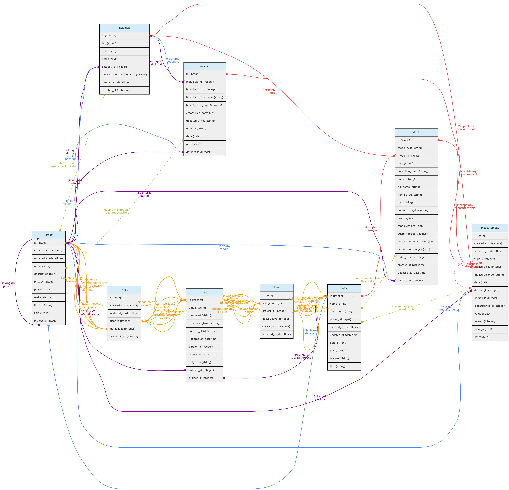

Os objetos centrais são: [Localidades](/docs/concepts/core-objects/#location), [Vouchers](/docs/concepts/core-objects/#voucher), [Individual](/docs/concepts/core-objects/#individual) e [Taxons](/docs/concepts/core-objects/#taxon). Essas entidades são consideradas "centrais" porque podem receber [Medições](/docs/concepts/trait-objects/#measurement), ou seja, você pode registrar valores para qualquer [Variável](/docs/concepts/trait-objects/#trait).

[Conjuntos de dados](/docs/concepts/data-access/#dataset) controlam acesso aos dados e representam um publicação de dados dinâmica, cuja versão é definida pela data da última edição do registros incluídos. Conjuntos de dados contém [Medições](/docs/concepts/trait-objects/#measurement), [Indivíduos](/docs/concepts/core-objects/#individual), [Vouchers](/docs/concepts/core-objects/#voucher) e [Arquivos de Mídia](/docs/concepts/auxiliary-objects/#media).

[Projects](#projects) são apenas grupos de [Conjuntos de dados](/docs/concepts/data-access/#dataset)  e de  [Usuários](/docs/concepts/data-access/#user), representando grupos de usuários com acessibilidade comum a conjuntos de dados cuja privacidade é definida para ser controlada por um projeto.

Essas duas entidades devem ter pelo menos um [Usuário](/docs/concepts/data-access/#user) definido como `administrador`, que tem controle total sobre o conjunto de dados ou projeto, incluindo a atribuição das seguintes funções a outros usuários:`administrador`, `colaborador` ou` visualizador `:
* **Colaboradores** podem inserir e editar objetos, mas não podem excluir registros, nem alterar o conjunto de dados ou a configuração do projeto.
* **Visualizadores** têm acesso somente de leitura aos dados que não são de acesso aberto.
* Apenas **usuários plenos** e **super-admins** podem ser designados como **administradores** ou **colaboradores**. Assim, se um usuário que era administrador ou colaborador de um conjunto de dados for rebaixado a "Usuário registrado", ele se tornará um visualizador.

***

## Conjuntos de Dados

**Conjuntos de Dados** são grupos de [Medições](/docs/concepts/trait-objects/#measurement), [Indivíduos](/docs/concepts/core-objects/#individual), [Vouchers](/docs/concepts/core-objects/#voucher) [Arquivos de Mídia](/docs/concepts/auxiliary-objects/#media), ae podem ter um ou mais [Usuários](/docs/concepts/data-access/#user) `administrators`, `collaborators` or `viewers`. Administradores podem definir o  `nivel de acesso` para *acesso público*, *restrito à usuários cadastrados* or *restrito à usuários autorizados* or *restrito à usuários do projeto*. Este controle de acesso aos dados dentro de um conjunto de dados, conforme exemplificado no diagrama abaixo:

Conjuntos de dados podem ter muitas [Referências bibliográficas](/docs/concepts/auxiliary-objects/#bibreference), que junto com os campos `policy`,` metadata` permitem anotar o conjunto de dados com informações relevantes para o compartilhamento de dados:
    * Vincule qualquer publicação que tenha usado o conjunto de dados e, opcionalmente, indique se são de citação obrigatória ao usar os dados;
    * Defina uma `política` de dados específica ao usar os dados além de uma `licença` pública [CreativeCommons.org]((https://creativecommons.org/licenses/)
    * Detalhe quaisquer `metadados` relevantes, além daqueles que são automaticamente recuperados do banco de dados, como as definições dos [Variáveis](/docs/concepts/trait-objects/#trait) medidas.

***

## Projetos

**Projetos** são apenas grupos de [Conjuntos de dados](/docs/concepts/data-access/#dataset) e interagem com [Usuários](/docs/concepts/data-access/#user), tendo `administradores`,`colaboradores` ou `visualizadores`. Esses usuários podem controlar todos os conjuntos de dados dentro do Projeto que tenham como política de acesso *restrita aos usuários do projeto*.

***

## Usuários

O tabela **users** armazena informações sobre os usuários e administradores do banco de dados. Cada **Usuário** pode ser associado a uma [Pessoa](/docs/concepts/auxiliary-objects/#person). Quando esse usuário insere novos dados, essa pessoa é usada como a pessoa padrão nos formulários. A pessoa só pode estar associada a um único usuário.

Existem três **níveis de acesso** possíveis para um usuário:
    * `Usuário registrado` (o nível mais baixo) - tem muito poucas permissões
    * `Usuário pleno ou completo` - podem ser atribuídos como administradores ou colaboradores de Projetos e Conjuntos de Dados;
    * `SuperAdmin` (o nível mais alto). - os superadministradores têm acesso a todos os objetos, independentemente da configuração do conjunto de dados. Categoria para os administradores da instalação.

Cada usuário é atribuído ao nível **usuário registrado** quando ele ou ela se registra em um sistema OpenDataBio. Depois disso, alguém que seja  **SuperAdmin** pode promovê-lo a `Usuário Pleno` ou `SuperAdmin`. Os SuperAdmins também podem editar outros usuários e removê-los do banco de dados.

Para cada usuário pleno é criado um projeto e um conjunto de dados de uso pessoal. Esses **workspaces** permitem que os usuários importem dados antes de incorporá-los a um projeto maior ou mais definitivo.

**Acesso a dados**: os usuários são criados no momento do registro. Apenas os administradores podem atualizar e excluir registros do usuário.

***

## Jobs do usuário
A tabela **user_jobs** é usada para armazenar temporariamente tarefas que são executadas em segundo plano, como a importação e exportação de dados. Qualquer usuário tem permissão para criar um Job; cancelar seus próprios Jobs; listar os Jobs que não foram excluídos.

A tabela **jobs** contém os dados usados ​​pelo framework Laravel para interagir com a Queue. Os dados desta tabela são excluídos quando o trabalho é executado com êxito. A tabela **user_jobs** é usada para manter essas informações, além de permitir logs do processo, repetir tarefas com erros e cancelar tarefas que ainda não foram concluídas.

**Acesso a dados**: Cada usuário registrado pode ver, editar e remover seus próprios Jobs.
