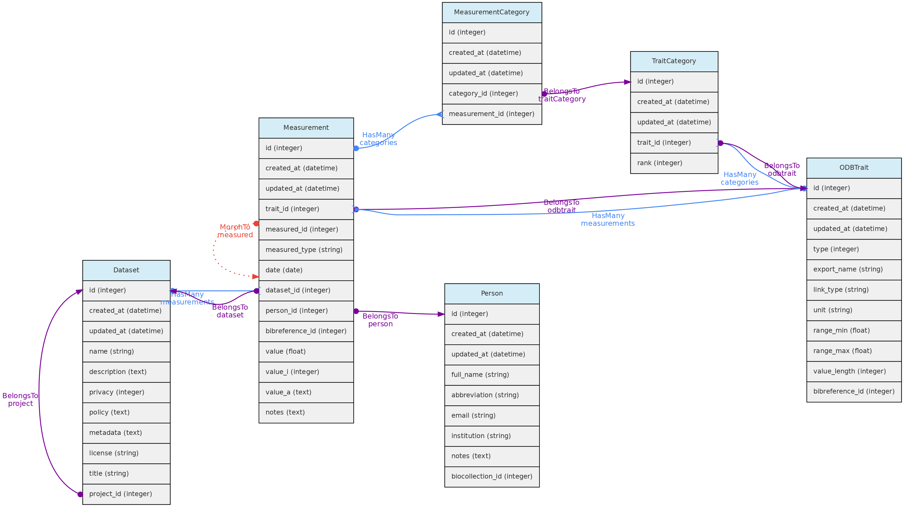
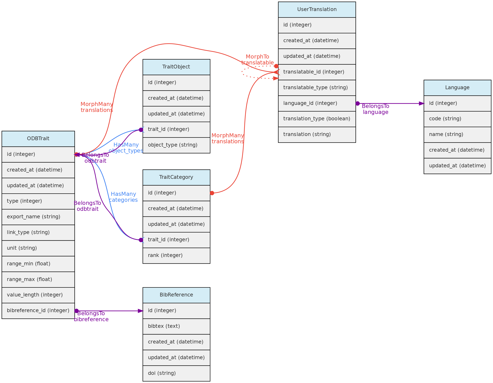

## Medições
A tabela **measurements** armazena os valores para [variáveis](/docs/concepts/trait-objects/#trait) medidas para os  [objetos centrais](/docs/concepts/core-objects). Seu relacionamento com os objetos centrais é definido por uma [relações polimórficas](/docs/contribution-guidelines/#polymorphic-relationships) usando as colunas `measured_id` e` measured_type`. Essas relações MorphTo são ilustradas e explicadas na página [objetos centrais](/docs/concepts/core-objects).

* **medições** devem pertencer a um [Conjuntos de dados](/docs/concepts/data-access/#dataset) - coluna `dataset_id`, que controla a política de acesso
* Uma [Pessoa](/docs/concepts/auxiliary-objects/#person) deve ser indicada como o **medidor** (`person_id`);
* A coluna `bibreference_id` pode ser usada para vincular medições extraídas de publicações à sua fonte [fonte Bibliográfica](/docs/concepts/auxiliary-objects/#bibreference)
* O **valor** para a variável medida (`trait_id`) será armazenado em colunas diferentes, dependendo do **tipo de variável**:
  * `value` - esta coluna flutuante armazenará valores para características reais quantitativas;
  * `value_i` - esta coluna inteira armazenará valores para características Quantitative Integer; e é um campo opcional para características do tipo Link, permitindo, por exemplo, armazenar contagens para uma espécie (uma característica Link Taxon) em um local.
  * `value_a` - esta coluna de texto armazenará valores para os tipos de traço Texto, Cor e Espectral.
* Valores para variáveis categóricas e ordinais são armazenados na tabela `measurement_category`
* `data` - a data de medição é obrigatória em todos os casos

**Acesso a dados** As medições pertencem a [Conjuntos de dados](/docs/concepts/data-access/#dataset), portanto, a política de acesso a conjuntos de dados se aplica às medições nele. Apenas os colaboradores e administradores do conjunto de dados podem inserir ou editar medições em um conjunto de dados, mesmo se o conjunto de dados for de acesso público.

***

## Variáveis
A tabela **traits** representa as variáveis ​​definidas pelo usuário para coletar [Medições](/docs/concepts/data-access/#measurement)para um dos [objetos centrais](/docs/concepts/core-objects).

Essas características personalizadas fornecem enorme flexibilidade aos usuários para registrar suas variáveis ​​de interesse. Obviamente, tal flexibilidade tem um custo na padronização dos dados, pois uma mesma variável pode ser registrada de forma diferentes em qualquer instalação do OpenDataBio. Para minimizar a redundância na ontologia de características, os usuários que criam características são avisados ​​sobre esse problema e uma lista de características semelhantes é apresentada no caso de ser encontrada por comparação de nomes de características.

As variáveis têm restrições de edição para evitar perda de dados ou alteração não intencional do significado dos dados. Portanto, embora a lista de variáveis esteja disponível para todos os usuários, as definições de variáveis não podem ser alteradas se outra pessoa também usou a variável para armazenar medições.

Variáveis são entidades traduzíveis, então seus valores de `name` e` description` podem ser armazenados em vários idiomas (veja [traduções de usuário](/docs/auxiliary-objects/user-translation). Isso é colocado na tabela `user_translations` através de uma relação polimórfica.

A definição da variável deve ser tão específica quanto necessário. A medição da altura das árvores usando medição direta ou um clinômetro, por exemplo, pode não ser facilmente convertida de uma para outra e deve ser armazenada em variáveis diferentes. Portanto, é altamente recomendável que o campo de definição de variável inclua informações como instrumento de medição e outros metadados que permitam que outros usuários entendam se podem usar sua variável ou criar uma nova.

* A definição da variável deve incluir um `export_name`, que será usado durante as exportações de dados nos formulários de entrada da interface. **Os nomes de exportação devem ser únicos** e não devem ter tradução. São recomendados nomes de exportação curtos e [camelCase]​​(https://en.wikipedia.org/wiki/Camel_case) ou [PascalCase]​​(https://en.wikipedia.org/wiki/pascal_case).
* Os seguintes tipos de características estão disponíveis:
  * **Quantitativo real** - para números reais;
  * **Número inteiro quantitativo** - para contagens;
  * **Categórico** - para varáveis categóricas de seleção única;
  * **Múltiplo categórico** - para muitas categorias selecionáveis;
  * **Ordinal categórico** - para uma categoria ordenada selecionável (dados semiquantitativos);
  * **Texto** - para qualquer valor de texto;
  * **Cor** - para qualquer valor de cor, especificado pelo código de cor hexadecimal (paleta de cores)
  * **Link** - este é um tipo de variável especial no OpenDataBio. Apenas links para [Taxons](/docs/concepts/core-objects/#taxon) e [Vouchers](/docs/concepts/core-objects/#voucher) estão implementados. Exemplo de uso: se você deseja armazenar contagens de espécies conduzidas em uma [Localidade](/docs/concepts/core-objects/#location), você pode criar uma variável do tipo de link_taxon ou link_voucher. A medição para tal variável terá um campo opcional `value` para armazenar as contagens. Este tipo de característica também pode ser usado para especificar o hospedeiro de um parasita ou o número de insetos predadores.
  * **Espectral** - projetado para acomodar dados espectrais, compostos de vários valores de absorbância ou refletância para diferentes números de onda.
  * **GenBank** - armazena os números de acesso do [GenBank](https://www.ncbi.nlm.nih.gov/genbank/) que permitem recuperar dados moleculares vinculados a indivíduos ou vouchers armazenados no banco de dados através do [GenBank Serviço API](https://www.ncbi.nlm.nih.gov/home/develop/api/). **AINDA NÃO IMPLEMENTADO**
* A tabela Traits contém campos que permitem a validação do valor da medição, dependendo do tipo de variável:
  * `range_max` e` range_min` - se definido para variáveis quantitativas, as medições terão que se ajustar ao intervalo especificado;
  * `value_length` - obrigatório apenas para variáveis espectrais, valida o comprimento (número de valores) de uma medição espectral;
  * `link_type` - se a variável for do tipo Link, a medição em `value_i` deve ser um id do objeto do tipo de link;
  * Para variáveis do tipo cor, os valores são validados no processo de criação da medição e devem estar em conformidade com um código hexadecimal de cores. Um seletor de cores é apresentado na interface web para inserção e edição de medições de cores;
  * Variáveis categóricas e ordinais serão validadas para as categorias registradas ao importar medições por meio da [API](/docs/api);
* A coluna `unit` define a unidade de medida para a variável.
* A coluna `bibreference_id` é a chave de uma única [Referência Bibliográfica](/docs/concepts/auxiliary-objects/#bibreference) que pode ser vinculad à definição da variável.
* A tabela `trait_objects` armazena o tipo de [objetos centrais](/docs/concepts/core-objects) para o qual a variável pode ter uma medição;

**Acesso aos dados** O nome, definição, unidade e categorias de uma variável não podem ser atualizados ou removidos se houver alguma medição registrada no banco de dados. As únicas exceções são: (a) é permitido adicionar novas categorias para variáveis categóricas (não ordinais); (b) o usuário atualizando a variavel é a única pessoa que possui medições para a característica; (c) o usuário que atualiza a variável é um administrador de todos os conjuntos de dados com medições usando a variável.

***
## Formulários

Um **Formulário** é um grupo organizado de [variáveis](/docs/concepts/trait-objects/#trait) definido por um usuário para criar um formulário personalizado para inserir medições através da interface web. Um Formulário consiste em um grupo de variáveis ordenadas, que podem ser marcadas como "obrigatórias". As entidades relacionadas são o **Relatório** e o **Filtro**.

**Isso ainda é experimental e em desenvolvimento**
